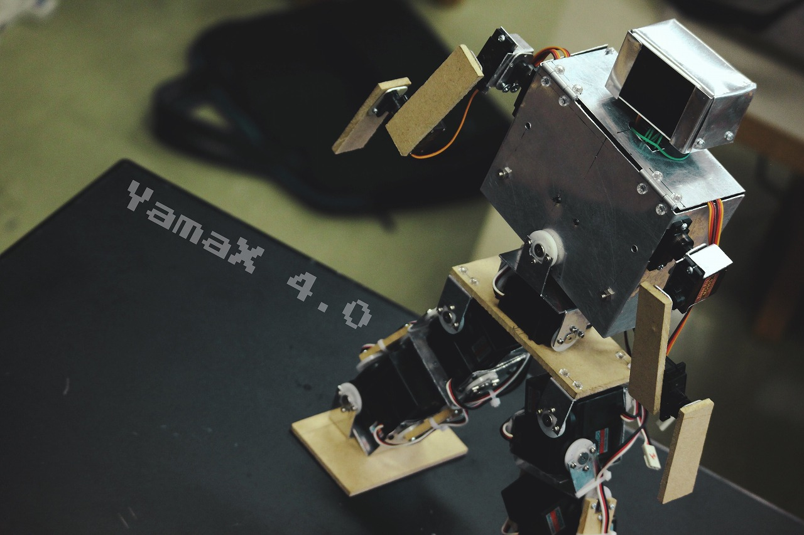
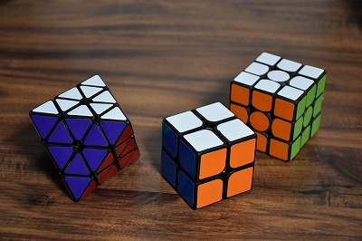
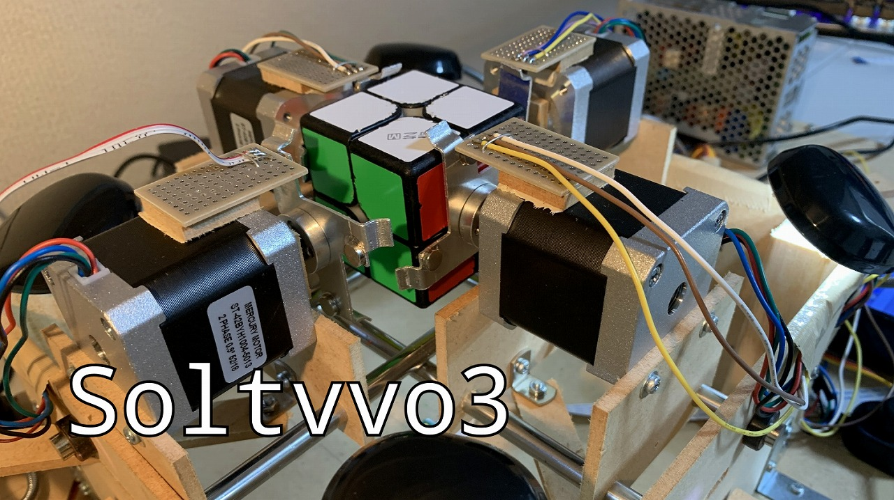
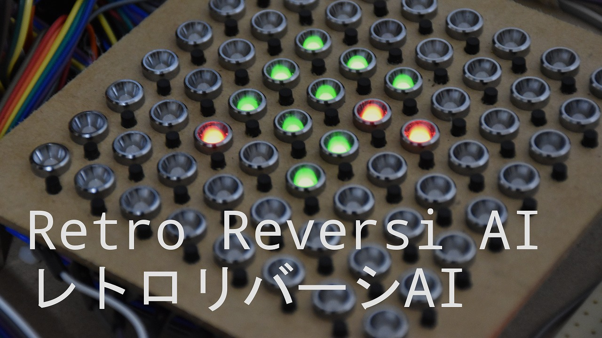
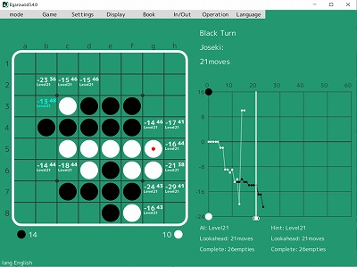
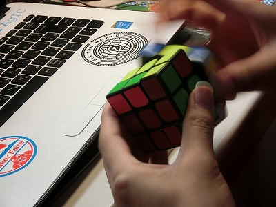
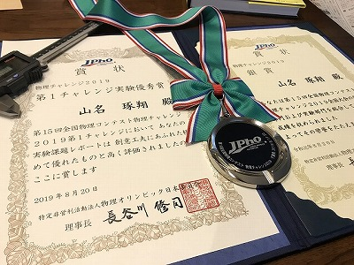
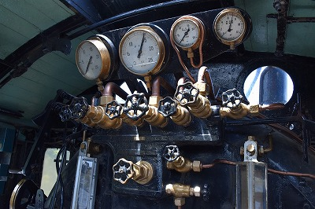

# Nyanyan (Takuto Yamana)

Maker, Speed Cuber

<a href="https://twitter.com/share?ref_src=twsrc%5Etfw" class="twitter-share-button" data-text="Nyanyan(Takuto Yamana)'s Website" data-url="https://nyanyan.github.io/" data-related="takuto_yamana,Nyanyan_Cube" data-show-count="false">Tweet</a> <a href=./../ja/>日本語</a>

## Me as a Maker

### Skills

Skills and assessment (max value is 100)

| Skill                                         | Assesment |
| :-------------------------------------------- | --------- |
| Programming (C++, Python, Cython, Javascript) | 90        |
| Optimization algorithm                        | 80        |
| Game AI algorithm                             | 80        |
| Competitive programming                       | 60        |
| Mechanical design                             | 70        |
| Hardware processing                           | 70        |
| Circuit design                                | 50        |
| Circuit production                            | 80        |

### Projects

My Projects: 

| Year      | Name             | Abstract                                                   | Detail & Related URL                                         |
| --------- | ---------------- | ---------------------------------------------------------- | ------------------------------------------------------------ |
| 2014      | Yamamijuta1      | A robot for RoboCup Junior Rescue A (Produced as a team)   | Loss at East Tokyo competition                               |
| 2014-2019 | YamaX            | DIY Humanoid Robot (Produced as a group)                   | [Maker Faire Exhibit Page](https://makerfaire.com/maker/entry/67738/) |
| 2017-2019 | MonoMotion       | A system for manuplating robots (Produced as a group)      | [Mitou Page in Japanese](https://www.ipa.go.jp/jinzai/mitou/2018/gaiyou_s-5) Chosen as a Mitou project and nominated as a super creator of Mitou |
| 2019-2021 | NyanTimer        | A timer for all speed cubers                               | [YouTube PV](https://youtu.be/ierR8ZPBncU)                   |
| 2020      | Soltvvo          | A robot to solve a 2x2x2 rubik's cube fastest in the world | [YouTube PV](https://youtu.be/Fok7bAn-NSs) Got most excellent award in Geekten |
| 2020      | Solvour          | A robot to solve a 4x4x4 rubik's cube                      | [YouTube PV](https://youtu.be/a2EKRblF6is)                   |
| 2020      | Solock           | A robot to solve a rubik's clock fastest in the world      | [YouTube demonstration](https://youtu.be/jc3e5xadDao)        |
| 2020-2021 | NyanClock        | DIY rubik's clock                                          | [YouTube PV](https://youtu.be/vNmKay3xpig)                   |
| 2021      | Studth           | A robot to solve a rubik's cube made of Artec blocks       | [YouTube demonstration](https://youtu.be/ETX0saH9TMM)        |
| 2021      | QiaoKe           | DIY 2x2x2 rubik's cube                                     | [YouTube PV](https://youtu.be/NJjfOaxSceI)                   |
| 2021      | CuYu             | Rubik's cube-shaped musical instrument                     | [YouTube PV](https://youtu.be/FqXL8PYMV98)                   |
| 2021-2022 | Retro Othello AI | Othello AI with 8 bit microcontroller                      | [YouTube PV](https://youtu.be/I_ctZKlP2XA) Got most excellent award in Geekten 2021 |
| 2021-2022 | Egaroucen        | World weakest othello AI                                   | [Web version in Japanese](https://www.egaroucen.nyanyan.dev/) |
| 2021-     | Egaroucid        | World stringest othello AI and software with othello AI    | [Web version in japanese](https://www.egaroucid.nyanyan.dev/) [App version](https://www.egaroucid-app.nyanyan.dev/) |

### Gallery

## Me as a speed cuber

### Records

Please see [World Cube Association Official records](https://www.worldcubeassociation.org/persons/2018YAMA04).

### Gallery

## Others

### Hobbies

* Othello
* Physics
* Chorus
* Origami
* Paper-cutting
* Photos

### Gallery

## Achievement and Awards

| Year | Award                                                        |
| ---- | ------------------------------------------------------------ |
| 2018 | Presentation Award in ELCAS, Kyoto University                |
| 2018 | Second Award in Science Festival in Kyoto University         |
| 2018 | Mitou Award in Information-technology Promotion Agency, Japan |
| 2018 | Editor’s Choice in World Maker Faire New York 2018           |
| 2019 | Super Creator Award in Mitou, Information-technology Promotion Agency, Japan |
| 2019 | Silver Award in Japan Physics Olympiad 2019                  |
| 2019 | Most Excellent Experiment Award in Japan Physics Olympiad 2019 |
| 2020 | Most Excellent Award in Useless Development Category, Geekten |
| 2021 | Chosen as a creator of Kuma Foundation                       |
| 2021 | Most Excellent Award in Useless Development Category, Geekten 2021 |
| 2021 | 1st Place in the world (Othello, CodinGame)                  |

## Contact

Feel free to contact me!

| SNS                               | Account                                                  |
| --------------------------------- | -------------------------------------------------------- |
| Twitter (for submission of works) | https://twitter.com/takuto_yamana                        |
| Twitter (for other purposes)      | https://twitter.com/Nyanyan_Cube                         |
| Instagram                         | https://www.instagram.com/takutoyamana/                  |
| YouTube                           | https://www.youtube.com/channel/UCOMdTI1hhcNsWI3w4FkT2IQ |
| GitHub                            | https://github.com/Nyanyan/                              |

