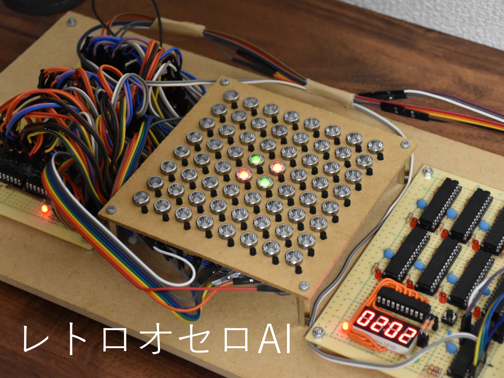

# Retro Othello AI

Othello AI with 8 bit microcontrollers (2021-2022)

Othello AI with 10 8 bit microcontrollers (ATMEGA328P), and its playing interface.

    

Speed up with parallel calculation. I used YBWC algorithm.

<iframe width="560" height="315" src="https://www.youtube.com/embed/I_ctZKlP2XA" title="YouTube video player" frameborder="0" allow="accelerometer; autoplay; clipboard-write; encrypted-media; gyroscope; picture-in-picture" allowfullscreen></iframe>

