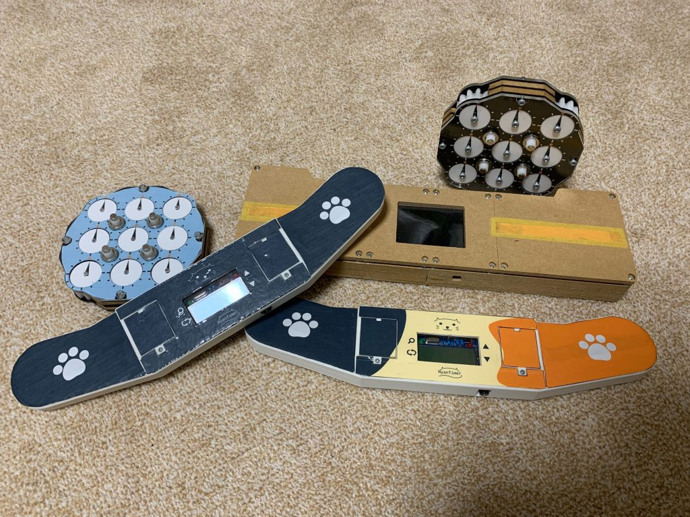

# Maker Faire Tokyo 2020

NyanTimer, NyanClock, Soltvvo (2020)

I exhibited NyanTimer, a timer for all cubers, NyanClock, rubik's-clock-like handmade puzzle, Soltvvo, a robot to solve a 2x2x2 cube.

    

## Detail

Date: 2020/10/3-4

Place: Tokyo Big Sight

[Exhibitor Page](https://makezine.jp/event/makers-mft2020/m0020/)

