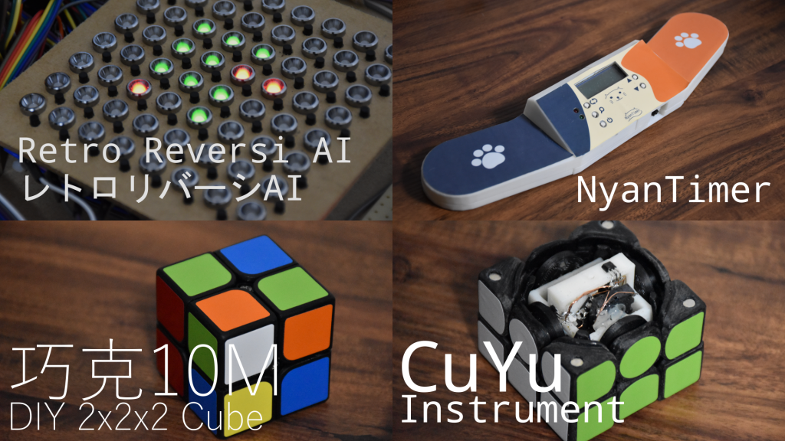

# Maker Faire Tokyo 2021

Rubik's Cube X Making, Othello X Making (2021)

I exhibited Retro Reversi AI, a reversi AI made of 8-bit microcontrollers, NyanTimer, a timer for all cubers, QiaoKe10M, a DIY 2x2x2 cube, and CuYu, a rubik's-cube-shaped musical instrument.

I had an oral presentation at Young Maker Challenge.

    

## Detail

Date: 2021/10/2-3

Place: Online

[Exhibitor Page](https://makezine.jp/event/makers-mft2021/m0034/)

