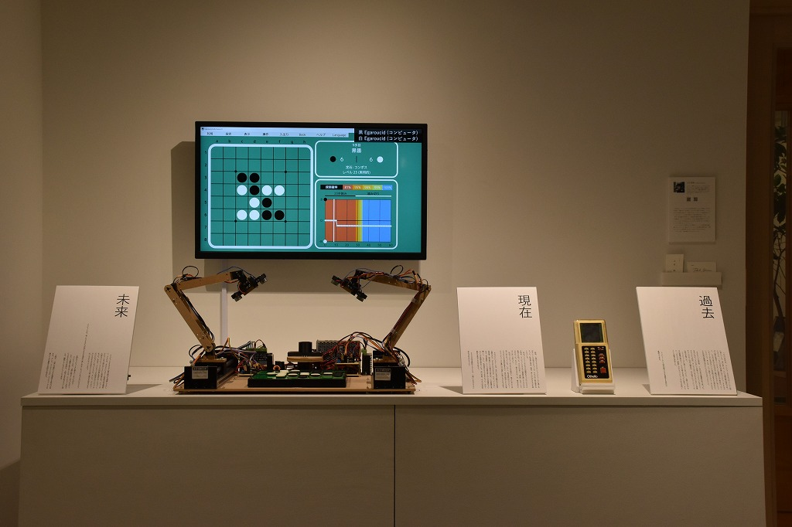

# Kuma experiment vol.1

Computers and Humans (2022)

I exhibited Isevot, Computer Othello, Sound of Othello, Past / Now / Future.

    

    

    

    

    

## Details

Date: 2022/10/15-23

Place: Kuma Foundation Gallery

[About this exhibition](https://kuma-foundation.org/gallery/event/kuma-experiment22-01/)
