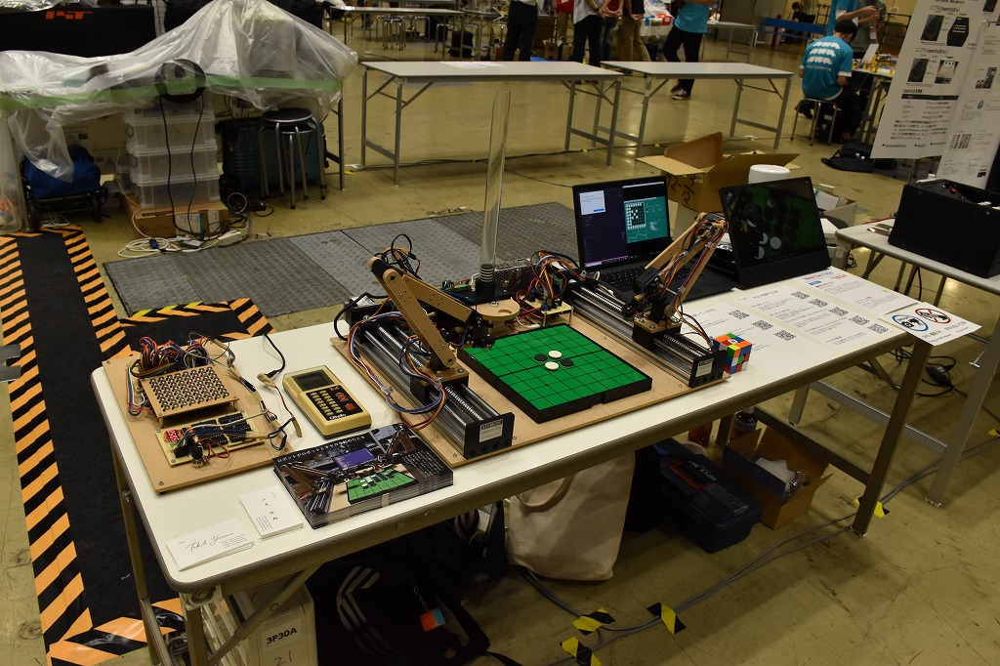

# Maker Faire Tokyo 2022

Hobbies and Making (2022)

I exhibited Isevot, Computer Othello, Egaroucid, Retro Othello AI.

I received SPRESENSE award, Young Maker Challenge.

    

## Detais

Date: 2022/9/3-4

Place: Tokyo Big Sight

[Exhibitor Page](https://makezine.jp/event/makers-mft2022/m0042/)

