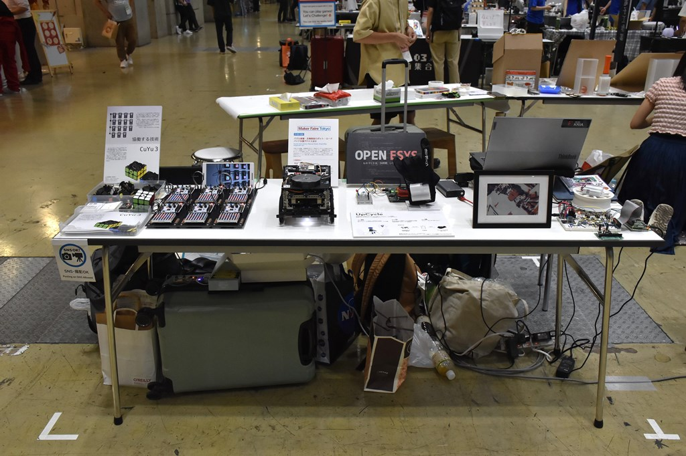
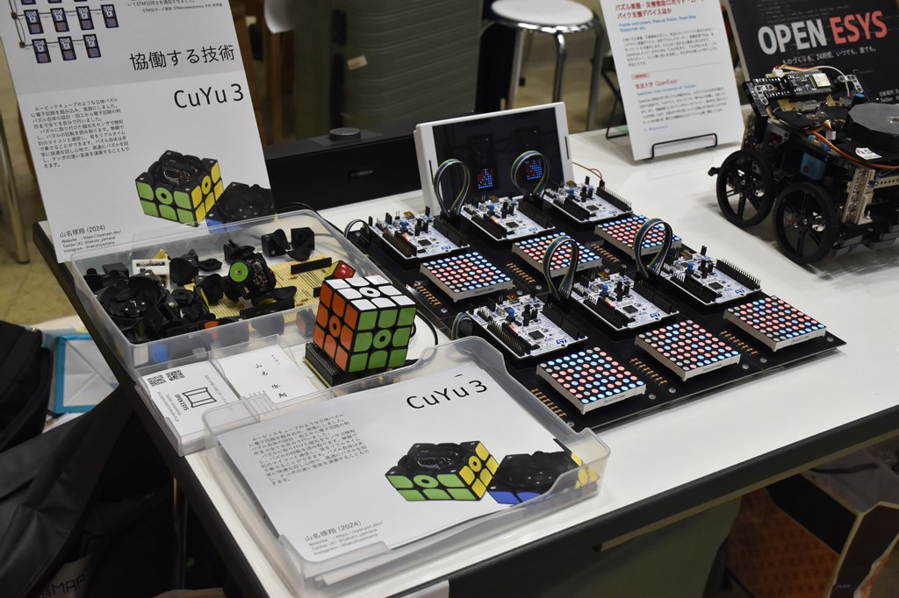
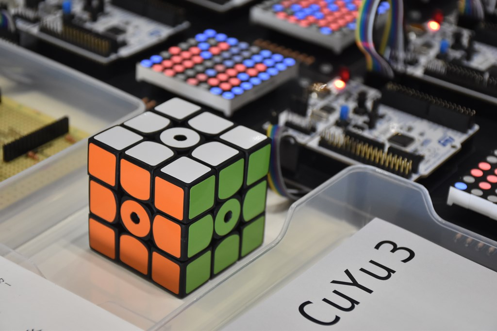
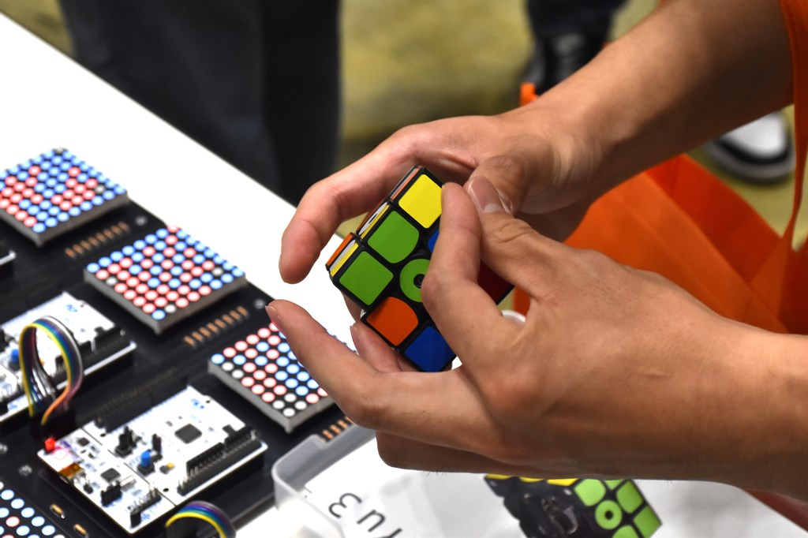
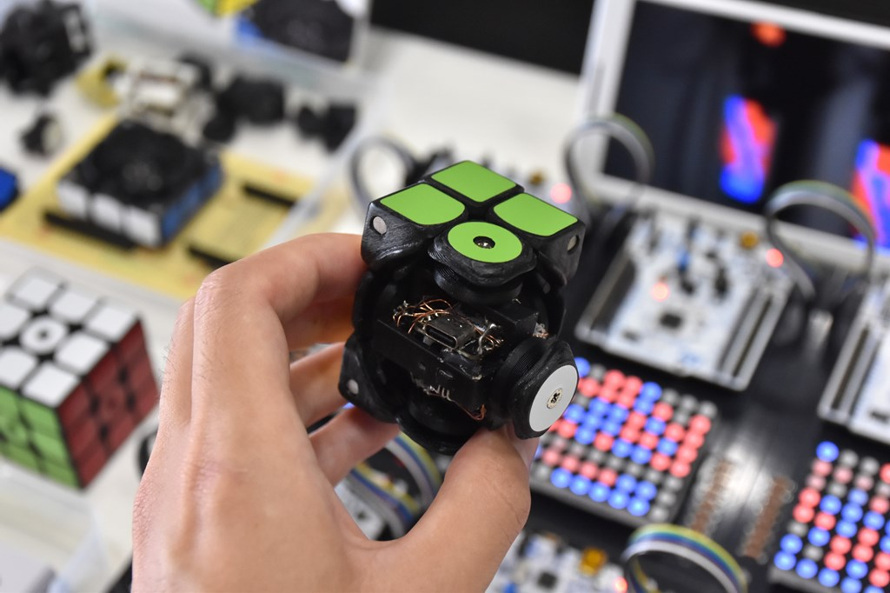

# Maker Faire Tokyo 2024

Puzzle Instrument, Rescue Robot, Road Bike Supporter etc. (2024)

I exhibited as a group "OpenEsys" from University of Tsukuba.

My works are CuYu3 and Cotechnology.

    
    
    
    
    

## Detais

Date: 2024/9/21-22

Place: Tokyo Big Sight

[Exhibitor Page](https://makezine.jp/event/makers-mft2024/m0149/)

