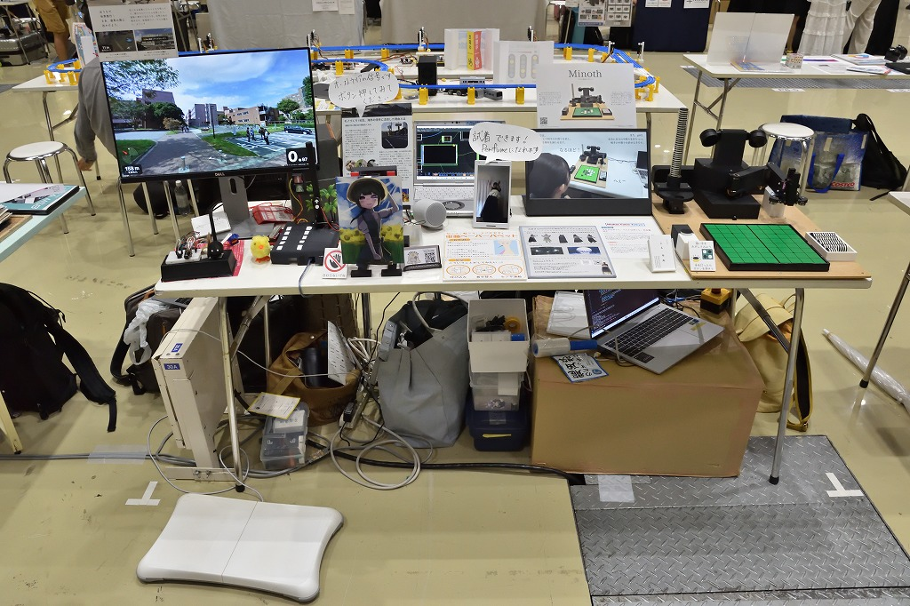
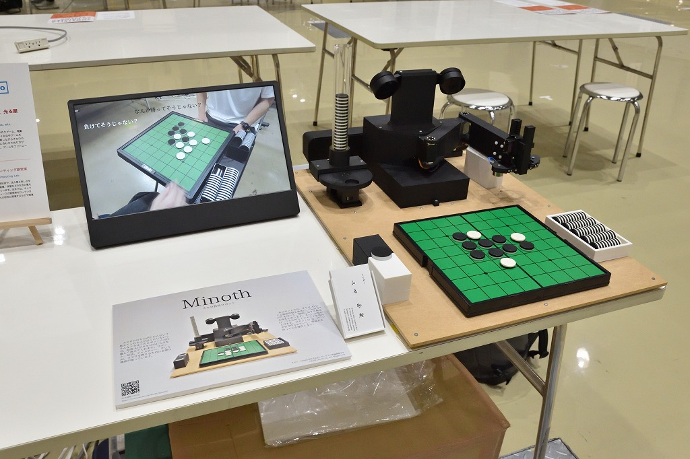
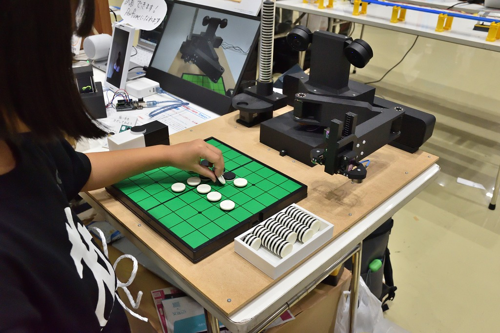
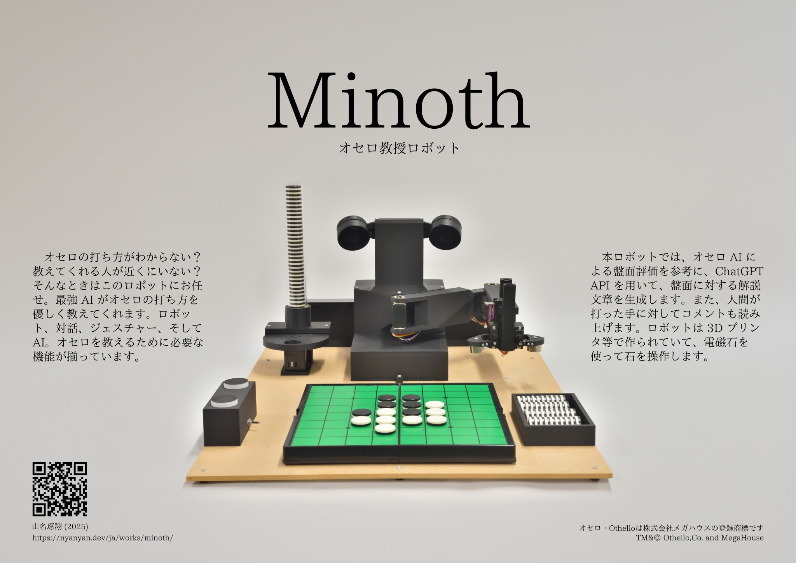
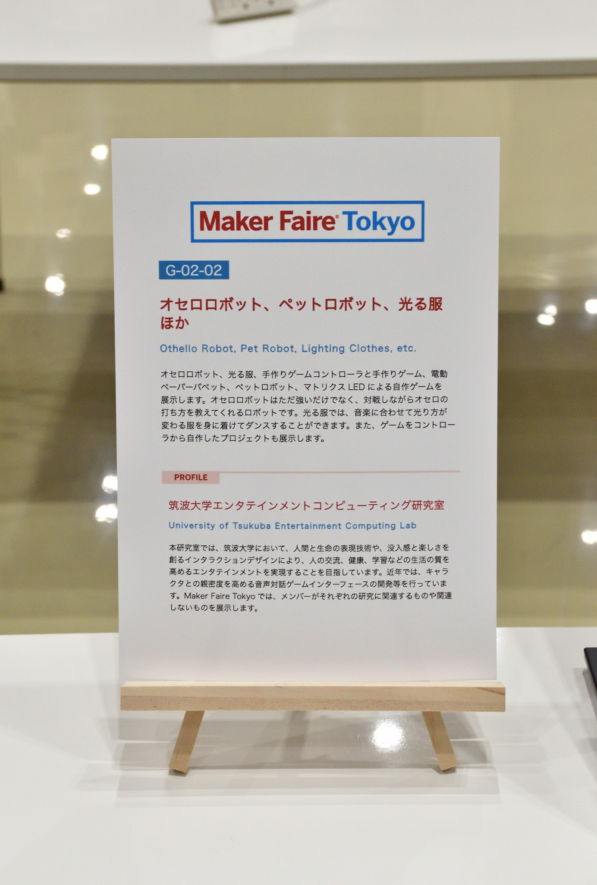

# Maker Faire Tokyo 2025

Othello Robot, Pet Robot, Luminous Clothes, etc. (2025)

We exhibited as [University of Tsukuba Entertainment Computing Laboratory](https://entcomp.jp/).

My exhibit is the Othello Teaching Robot "Minoth".

    
    
    
    
    

## Details

Official Page: [Maker Faire Tokyo 2025](https://makezine.jp/event/mft2025/)

Date: 2025/10/4 (Sat) 12:00-18:00, 2025/10/5 (Sun) 10:00-17:00

Venue: Tokyo Big Sight, West Hall 4 (3-11-1 Ariake, Koto-ku, Tokyo)

Admission: [Advance] Adult 1,400 yen / 18 and under 500 yen, [Same day] Adult 1,800 yen / 18 and under 700 yen

[Exhibitor Page](https://makezine.jp/event/makers-mft2025/m0071/)

