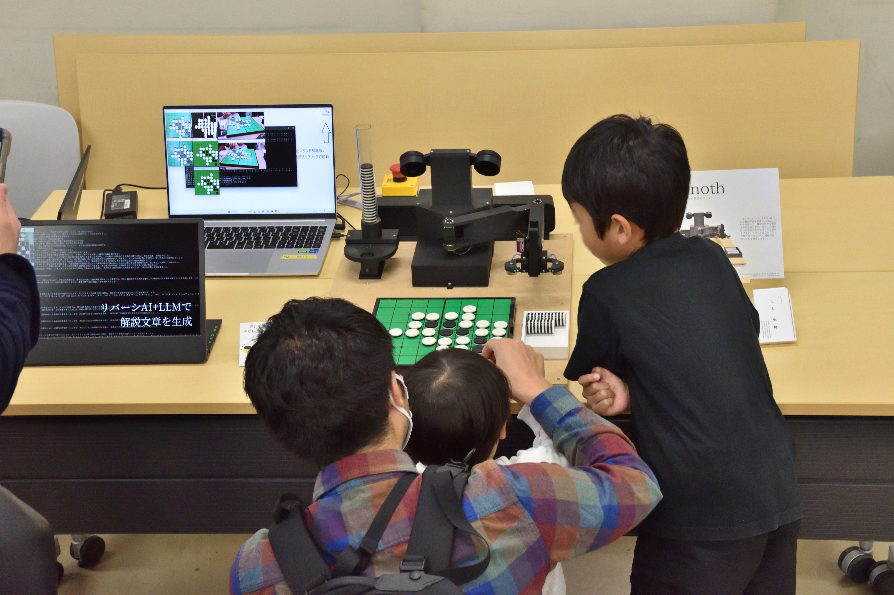
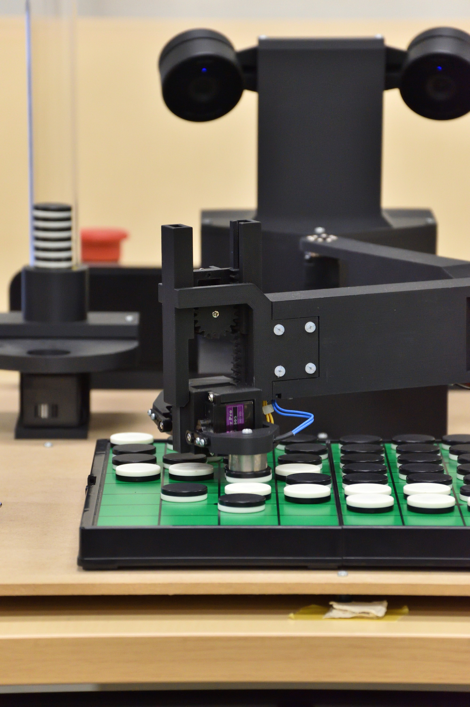
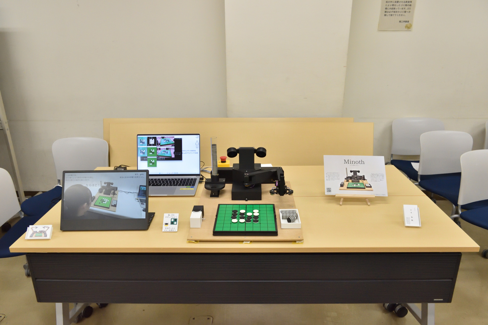

# Sohosai 2025 Craftsmanship Exhibition -Maker Deadline Festival-

Othello Teaching Robot "Minoth" (2025)

This is an exhibition at the "Maker Deadline Festival," an exhibition project at the University of Tsukuba's school festival, "Sohosai."

My exhibit is Minoth.

    
    
    

## Details

Date: 2025/11/02-03

Location: 3A203, University of Tsukuba

Calling all craft lovers! Robots, electronics, programming, and more. People who enjoy making things freely at the University of Tsukuba will hold a unique exhibition. Please come and see the "Makers" who enjoy their hobby of making things.
