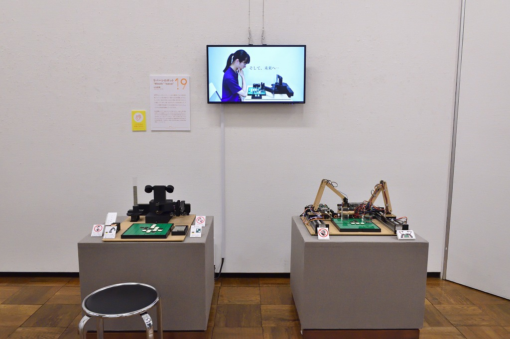
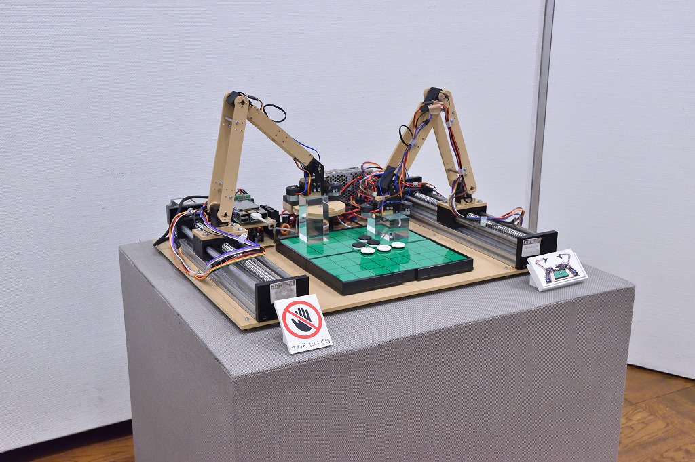
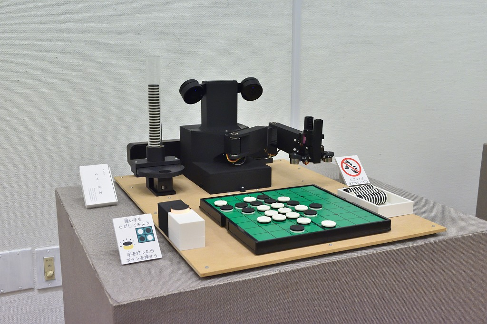
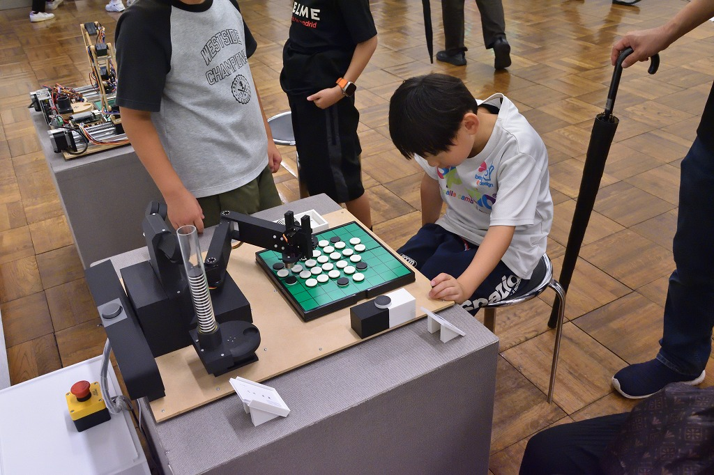
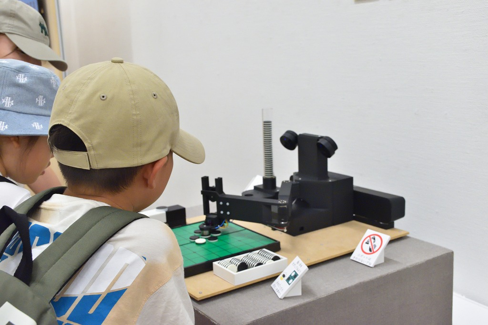
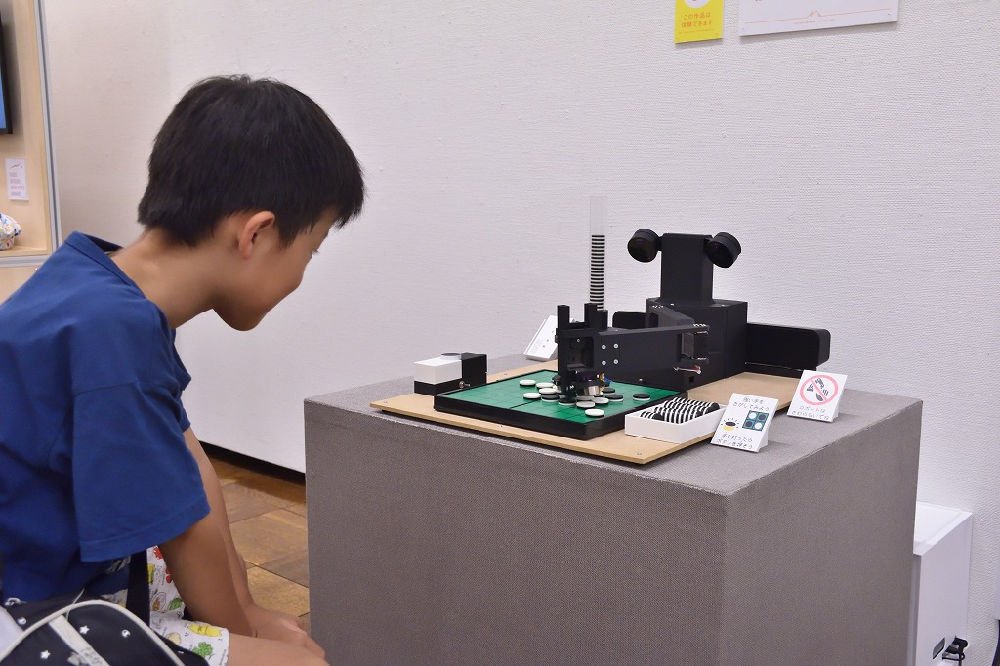
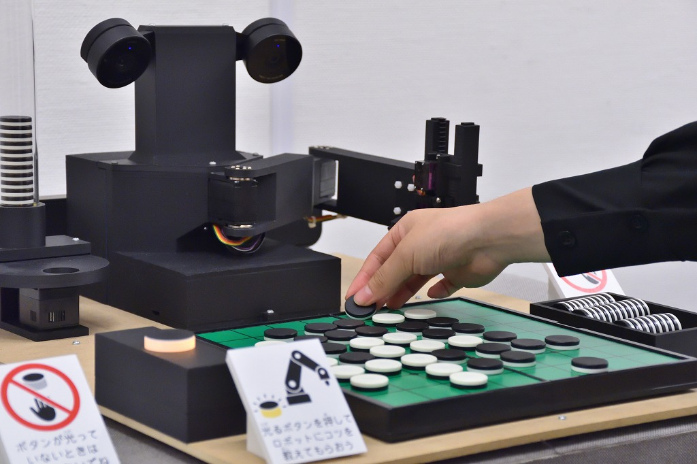

# The 7th Tsukuba Media Art Festival

Reversi Robots "Minoth" & "Isevot" (2025)

I exhibited "Minoth," a new Reversi professor robot, and "Isevot," a Reversi robot created in 2022.

## Artwork Caption

A quarter of a century has passed since a Reversi AI defeated the world champion. Reversi AI has become almost perfect in terms of strength. However, what AI can do is limited to just finding strong moves. What if there was a future where a strong AI had a robot body and could teach us how to win at Reversi? We invite you to experience such a future.

<iframe src="https://www.youtube.com/embed/jmoJRHh0pqM" title="YouTube video player" frameborder="0" allow="accelerometer; autoplay; clipboard-write; encrypted-media; gyroscope; picture-in-picture" referrerpolicy="strict-origin-when-cross-origin"  allowfullscreen></iframe>

    
    
    
    
    
    
    

## Details

The "Tsukuba Media Art Festival" started in fiscal 2014 with the aim of disseminating a culture unique to Tsukuba, taking advantage of the characteristics of "Tsukuba, a city of science," and this will be its 7th holding. With the cooperation of the "Engineering and Art Collaboration Research Group" of the University of Tsukuba, which boasts world-class achievements in the field of media art, we will exhibit a number of works that fuse technology and art beyond the fields by international artists produced by the University of Tsukuba and students selected through an open call within the university. See, experience, and learn about the results of cutting-edge research and a number of new ideas. Why not feel the charm of science x art?

◆Event Overview

Official page: [Tsukuba Media Art Festival 2025](https://www.tsukuba-artchannel.jp/page/page000181.html)

Dates: August 1, 2025 (Fri) - August 11, 2025 (Mon, holiday) Closed: August 4 (Mon)

Venue: Tsukuba Museum of Art, Ibaraki (2-8 Azuma, Tsukuba, Ibaraki TEL: 029-856-3711) [https://maps.app.goo.gl/FcX9PRP3SodK9ASp8](https://maps.app.goo.gl/FcX9PRP3SodK9ASp8)

Opening hours: 9:30-17:00 (closes at 13:00 on the last day, admission until 30 minutes before closing)

Free admission