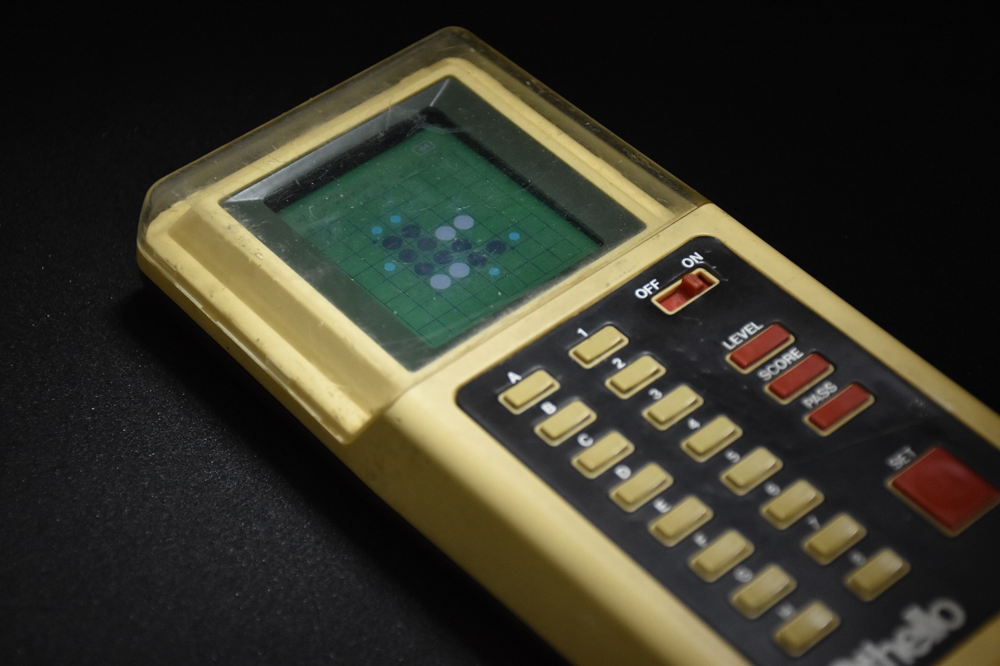

# Computer Othello

Retrofit an Othello AI sold in 1980 (2022)

In 1980s, there were a big interest in Othello AIs, computers would become stronger than humans or not. In the beginning of such a decade, an Othello AI, "Computer Othello M2" were sold from Tsukuda Original, Japan.

The original AI is much weaker than modern Othello AIs. But if I, who made the strongest Othello AI in the world, retrofit it with a latest edge AI, what will happen?

PV-MCTS algorithm runs on a Spresense from Sony.

    

    

