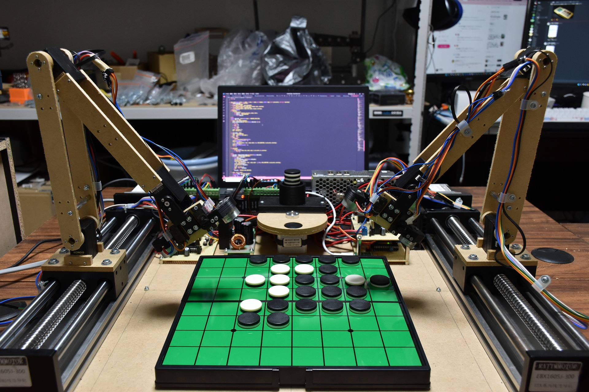

# Isevot

A Robot Plays Othello Against a Robot (2022)

Isevot is a pair of robots with Egaroucid, an Othello AI I made. They play Othello themselves.

I wrote <a href="https://note.com/nyanyan_cubetech/n/n7262af06aefb" target="_blank" el=”noopener noreferrer”>an article</a> about the backgrounds of this project in Japanese.

<iframe width="560" height="315" src="https://www.youtube.com/embed/bV2cLeHRmJw" title="YouTube video player" frameborder="0" allow="accelerometer; autoplay; clipboard-write; encrypted-media; gyroscope; picture-in-picture" allowfullscreen></iframe>

    

    

