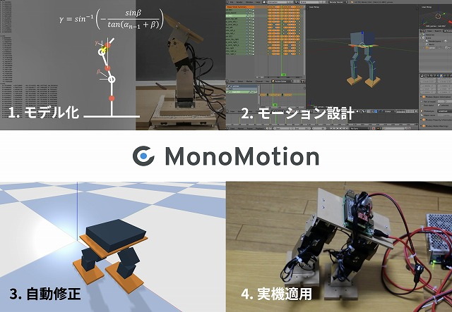

# MonoMotion

Robot motion creation support system (2017-2019)

We created a system that supports you to create a motion of your robot.

Learn more <a href="https://monomotion.netlify.app/" target="_blank" el=”noopener noreferrer”>here</a>.

    

This project is chosen as a Mitou project, Information-technology Promotion Agency, Japan. I've got Super Creator Prize in Mitou project.
