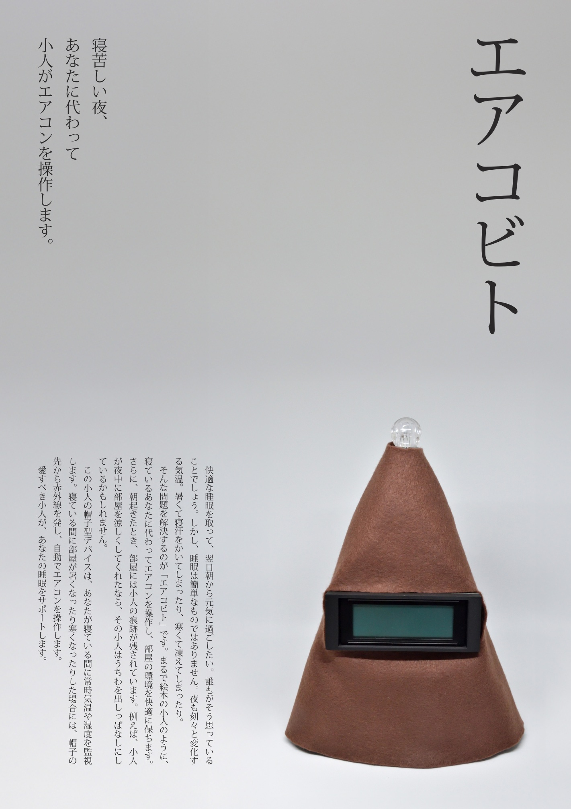

# Air-Elf

An elf who makes your sleep comfortable (2025)

This device measures the temperature, humidity, atmospheric pressure, and carbon dioxide concentration in your room while you sleep, and automatically controls the air conditioner.

## Artwork Caption

On a sleepless night, an elf will operate the air conditioner for you.

Everyone wants to get a good night's sleep and wake up feeling refreshed the next morning. But sleep is not that simple. The temperature changes from moment to moment throughout the night. You might sweat from the heat or shiver from the cold.

"Air-Elf" is the solution to these problems. Just like an elf from a picture book, it operates the air conditioner for you while you sleep, keeping your room comfortable. What's more, when you wake up in the morning, you'll find traces of the elf in your room. For example, if the elf cooled the room for you during the night, they might have left a fan out.

This elf's hat-shaped device constantly monitors the temperature and humidity while you sleep. If the room gets too hot or cold while you are sleeping, it emits an infrared signal from the tip of its hat to automatically control the air conditioner.
This lovable elf will support your sleep.

    
    
    

