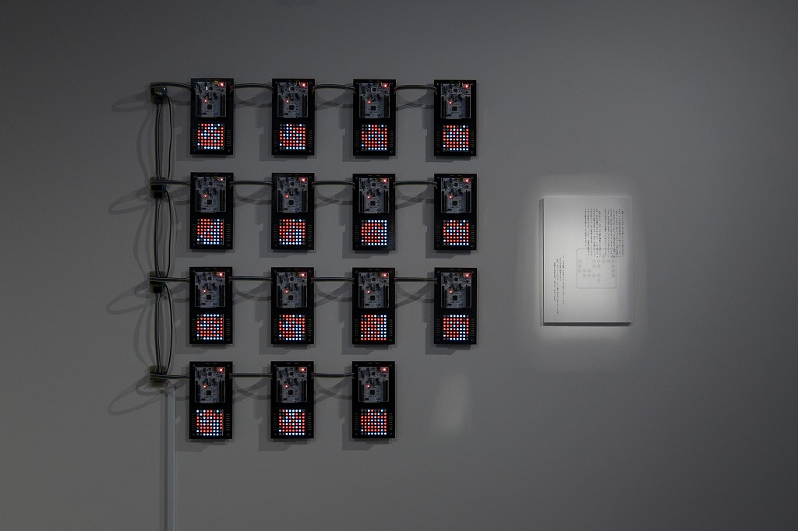
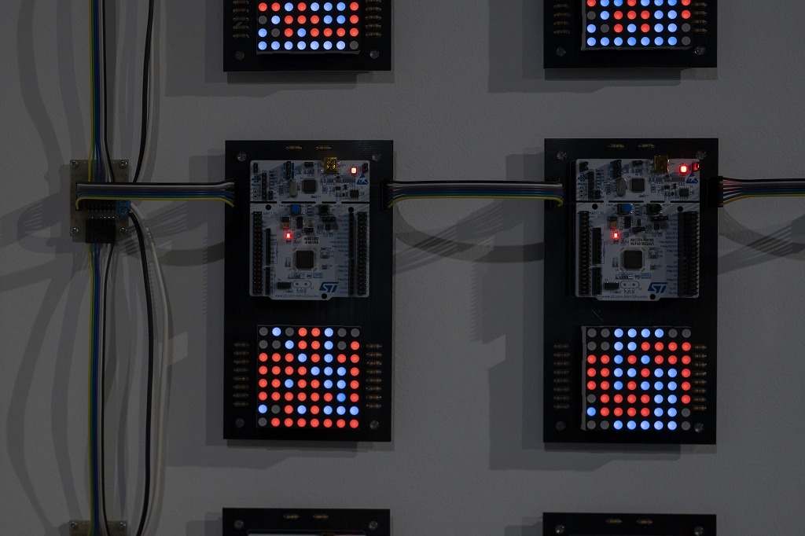

# Cotechnology

Parallel Othello AI with STM32 (2023)

This is a parallel Othello AI with microcontrollers. There are 15 nodes connected, and each node has a STM32F401 board and a matrix LED. This solves the exact score of an Othello board with 21 empties.

I compared the human society with the parallel computing.

STM32 Board Provided by STMicroelectronics Mr. Yoshiaki Nakamura

<iframe src="https://www.youtube.com/embed/7nRlb4U1kdU" title="YouTube video player" frameborder="0" allow="accelerometer; autoplay; clipboard-write; encrypted-media; gyroscope; picture-in-picture" allowfullscreen></iframe>

    

    

    

