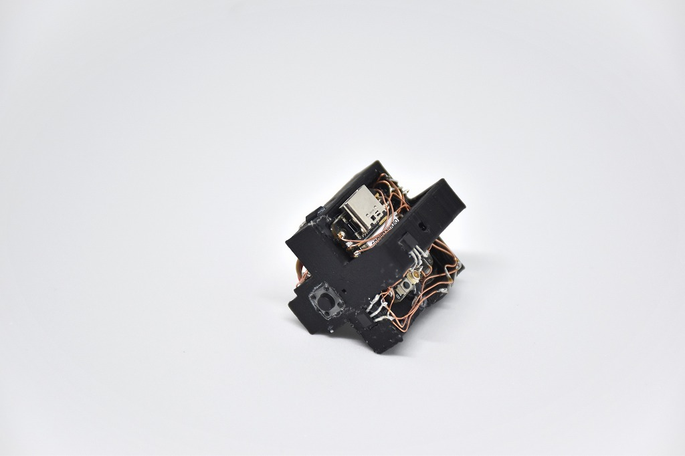
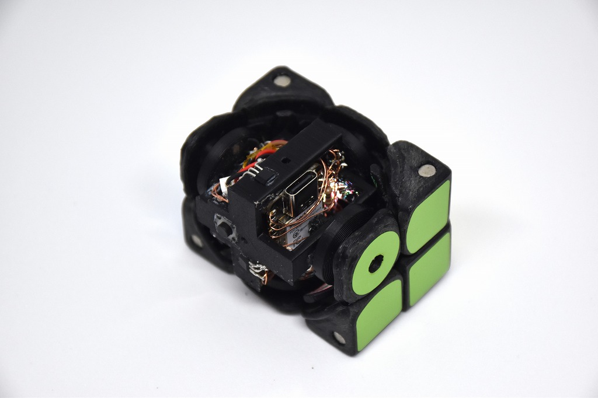
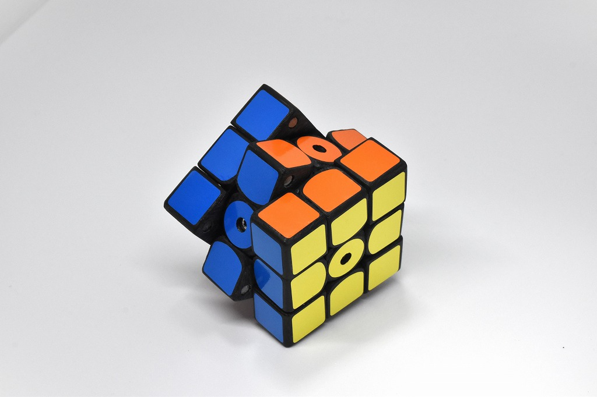

# CuYu2

Puzzle-shaped musical instrument (2024)

 I inserted circuits in a handmade rubik's-cube-like puzzle, and created a musical instrument.

This cube is an update of CuYu2 (2021). I used BLE with ESP32C3 and made a sound from PC.

<iframe src="https://www.youtube.com/embed/PpIETm3XO9Q" title="YouTube video player" frameborder="0" allow="accelerometer; autoplay; clipboard-write; encrypted-media; gyroscope; picture-in-picture" allowfullscreen></iframe>

    

    

    

