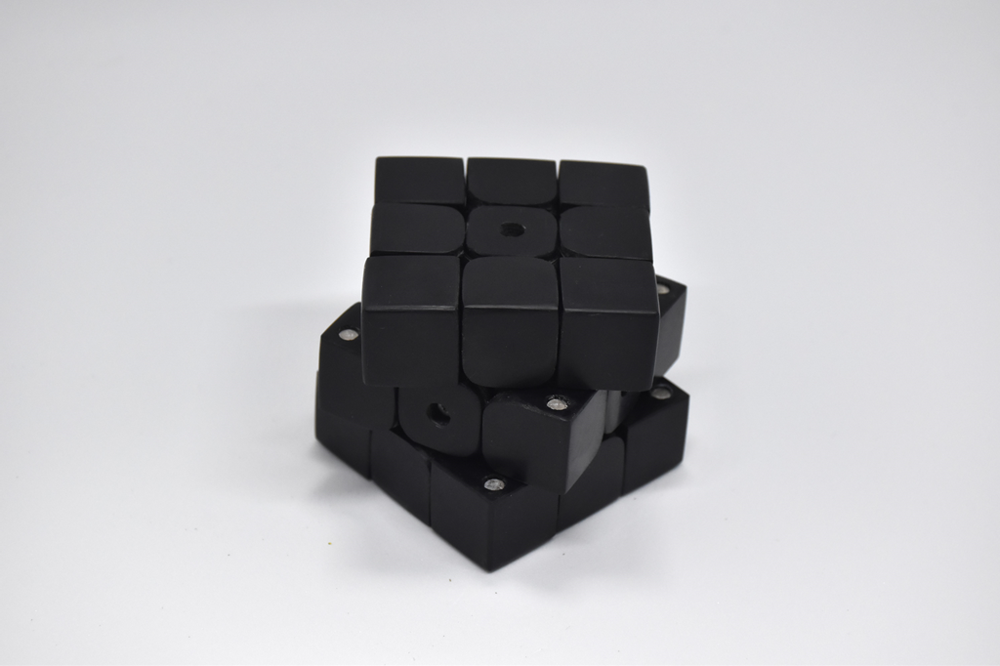

# CuYu3

Puzzle-shaped musical instrument (2024)

 I inserted circuits in a handmade rubik's-cube-like puzzle, and created a musical instrument. This is 3rd version of CuYu series.

ESP32C3 in the cube connects wirelessly with ESP32 on a speaker. CuYu2, previous version, uses a PC to produce sounds, but this version uses an independent speaker. In addition, five different musical scales are available and can be switched.

    

    

    

    

