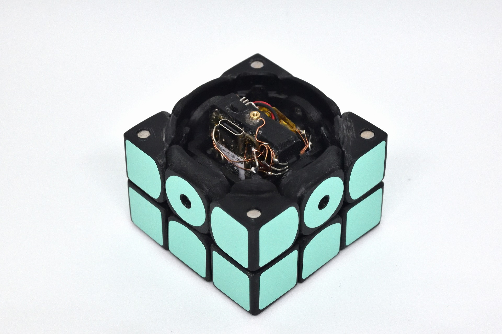
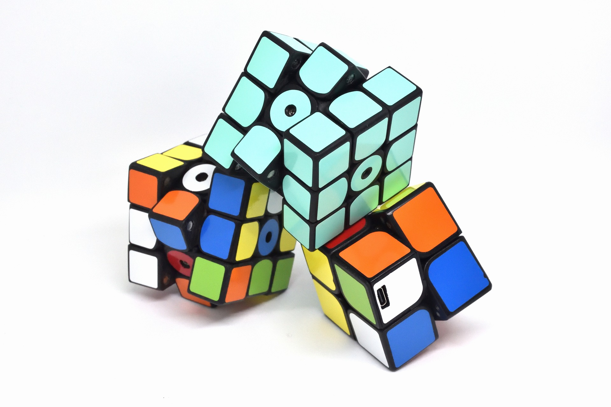
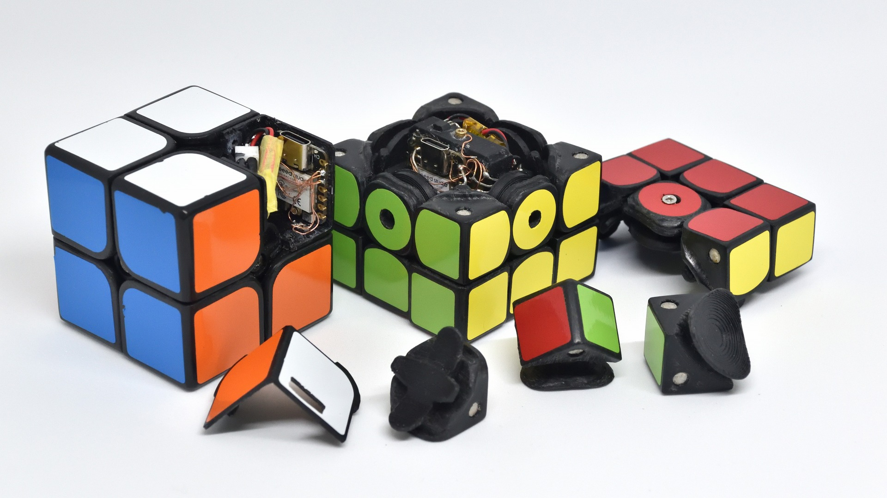
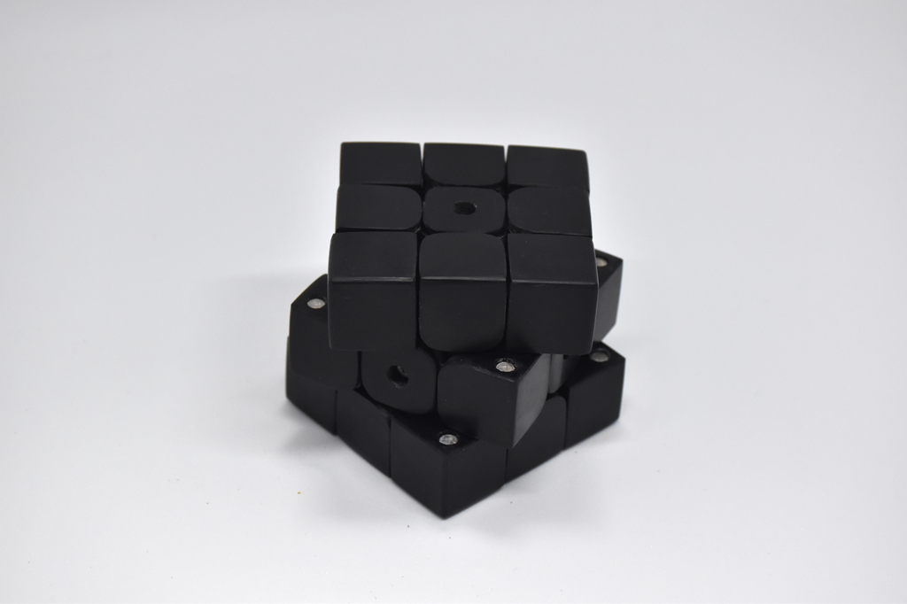
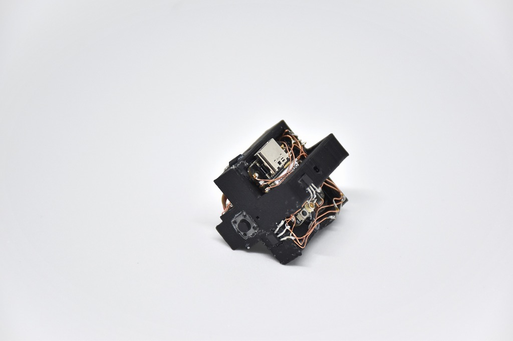
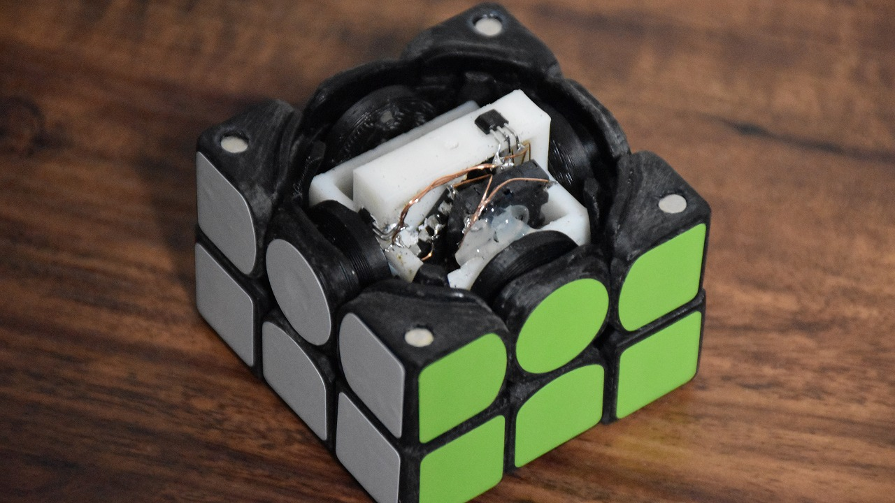

# CuYu

Puzzle-shaped musical instrument (2021-2024)

I inserted electronic circuits in a handmade 3D puzzle, and created a musical instrument. There are 3x3x3 versions and a 2x2x2 version.

A solve directly becomes a music. Also, turning like a pro becomes a music.

The puzzle was made with a 3D printer and has an ESP32C3 microcontroller and a hall sensor inside. It communicates wirelessly with an external speaker to play sounds. CuYu also supports external power supply via a dedicated charger.

Geekten 2024 WingArc1st Award

<iframe src="https://www.youtube.com/embed/PpIETm3XO9Q" title="YouTube video player" frameborder="0" allow="accelerometer; autoplay; clipboard-write; encrypted-media; gyroscope; picture-in-picture" allowfullscreen></iframe>

    

    

    

    

    

    

    

