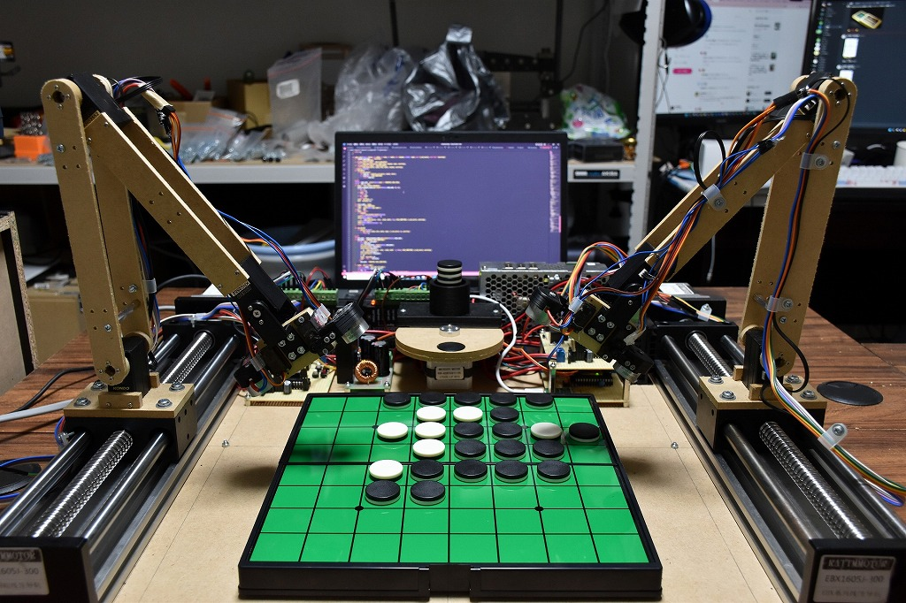

# Isevot

Othello played by robots (2022)

Isevot is a pair of robots with Egaroucid, an Othello AI I made. They play Othello themselves.

I wrote [an article](https://note.com/nyanyan_cubetech/n/n7262af06aefb) about the backgrounds of this project in Japanese.

I've got [Excellent Award in Useless Development Category, Geekten 2022](https://talent.supporterz.jp/geekten/2022/) with this project.

<iframe src="https://www.youtube.com/embed/bV2cLeHRmJw" title="YouTube video player" frameborder="0" allow="accelerometer; autoplay; clipboard-write; encrypted-media; gyroscope; picture-in-picture" allowfullscreen></iframe>

    

    

