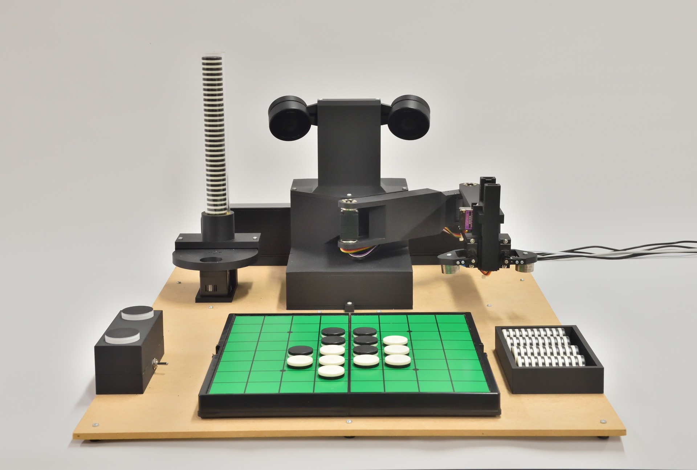
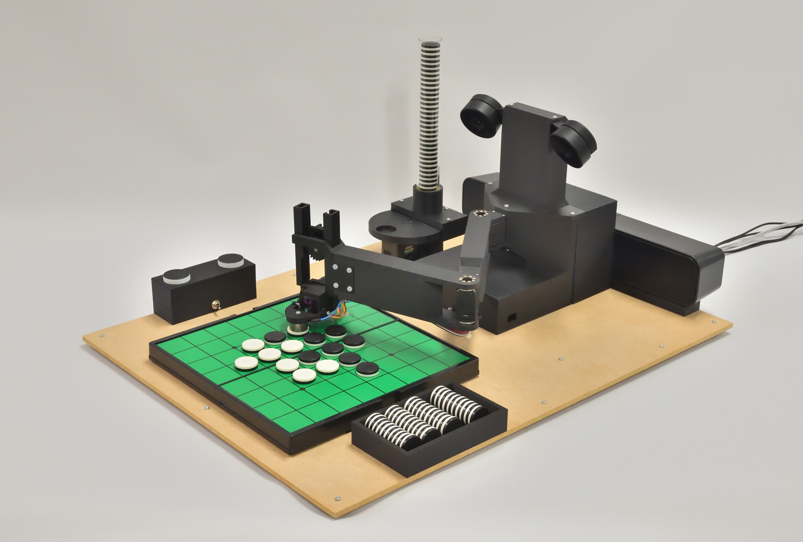
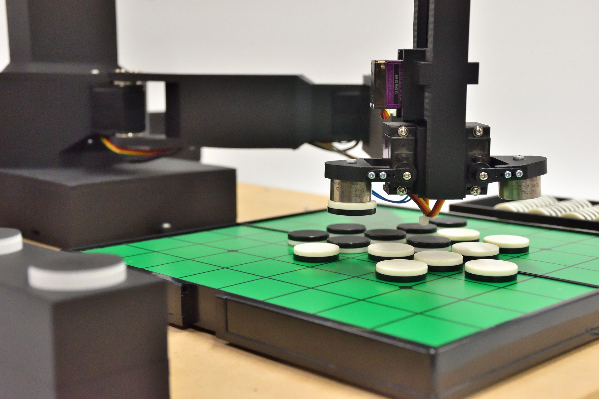
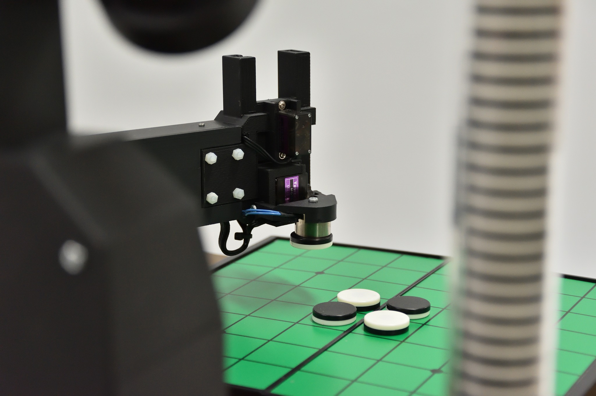

# Minoth

Othello Teaching Robot (2025-present)

This robot teaches humans how to play Othello.

It is equipped with a custom-made Othello AI and an Othello commentary system on a custom-made robot.

The robot recognizes the board with two cameras and manipulates the pieces with an arm equipped with an electromagnet. It uses a chess clock-style device to conduct a teaching game with a human.

There is a video about this robot in Japanese:

<iframe src="https://www.youtube.com/embed/Ok0Ple36Ebs" title="YouTube video player" frameborder="0" allow="accelerometer; autoplay; clipboard-write; encrypted-media; gyroscope; picture-in-picture" allowfullscreen></iframe>

    
    
    
    

