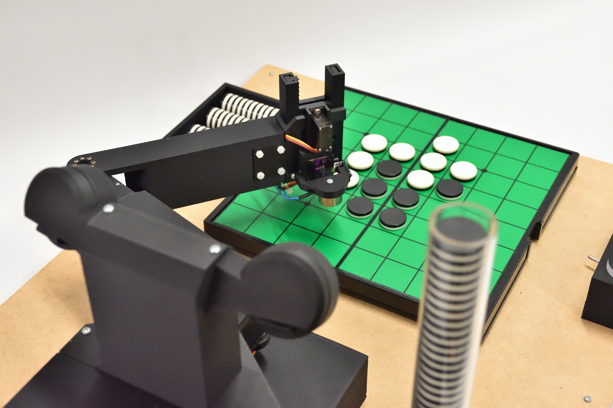

# Minoth

Othello Teaching Robot (2025-present)

This robot teaches humans how to play Othello.

It is equipped with a custom-made Othello AI and an Othello commentary system on a custom-made robot.

The robot recognizes the board with two cameras and manipulates the pieces with an arm equipped with an electromagnet. It uses a chess clock-style device to conduct a teaching game with a human.

    
    
    
    

