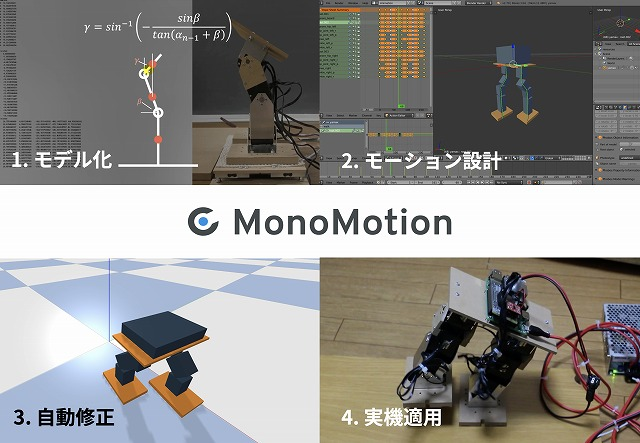

# MonoMotion

Robot motion creation support system (2017-2019)

We created a system that supports you to create a motion of your robot.

Learn more [here](https://monomotion.netlify.app/).

We are adopted in IPA Mitou 2018, and selected as a Super Creator with this project.

    

