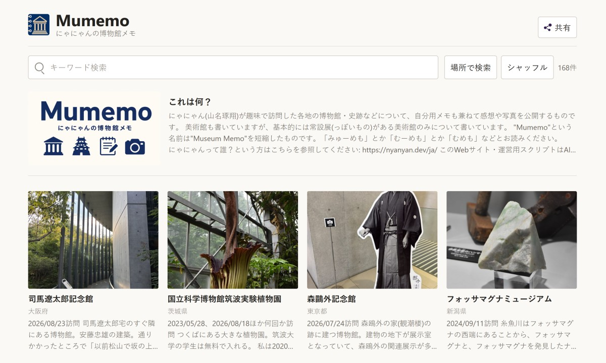
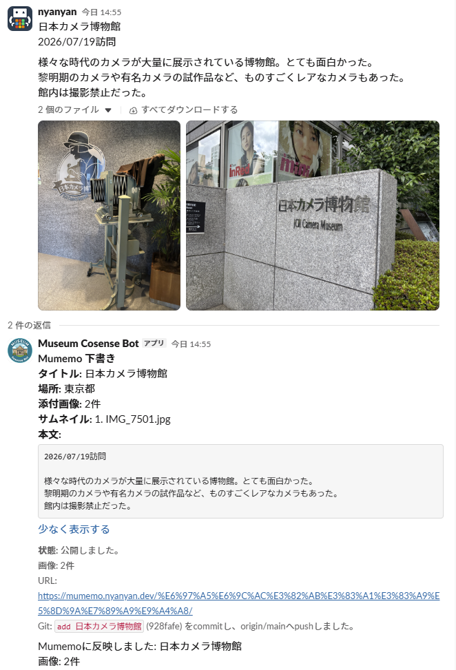

# Mumemo

Nyanyan's Museum Notes (2026)

This website publishes photos and notes from museums I have visited as a hobby.

Website: [https://mumemo.nyanyan.dev/](https://mumemo.nyanyan.dev/)

The website is integrated with Slack: when I post text to Slack, the content is reflected on the website. It also uses the OpenStreetMap API to automatically identify locations, making it possible to search by place.

    
    

