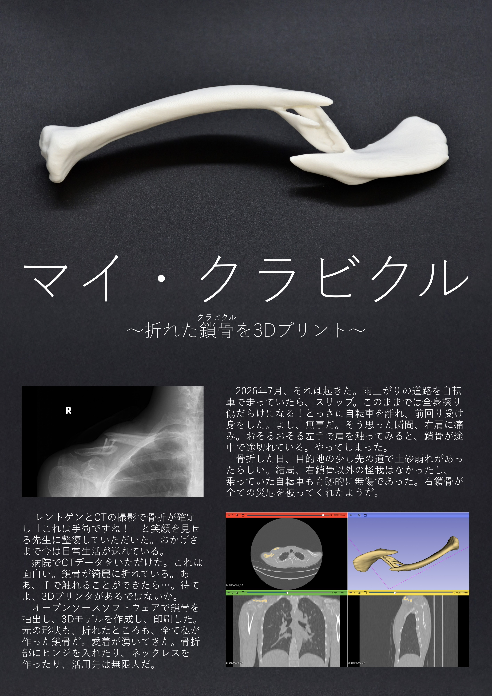

# My Clavicle

3D-printed fractured clavicle (2026)

In July 2026, I fell while riding a bicycle and fractured my right clavicle. "My Clavicle" is a 3D-printed object made from a 3D model created from the CT data taken at that time. It clearly shows how my right clavicle had broken into about four bone fragments. I also turned it into a puzzle by adding hinges at the fractured parts, so that reduction (returning displaced bones to their correct positions) can be performed.

As of August 2026, I have had the fracture reduced through surgery and am recovering.

    
    
    
    
    
    

