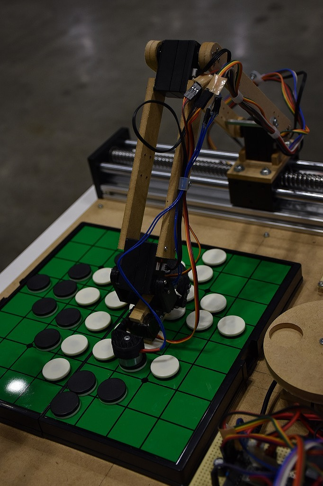

# EdgeTech+ 2022

Maker Faire Tokyo 出張版 (2022)

オライリー・ジャパンのブースにて、Maker Faire Tokyo 出張版として出展しました。

出展物はIsevot、コンピューターオセロ、Egaroucid、レトロオセロAIです。

    

    

    

    

    

## 詳細

日程: 2022/11/16-18

場所: パシフィコ横浜

