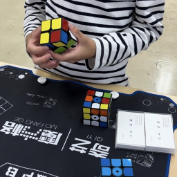
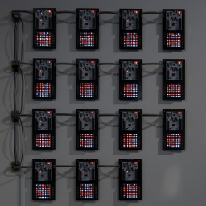
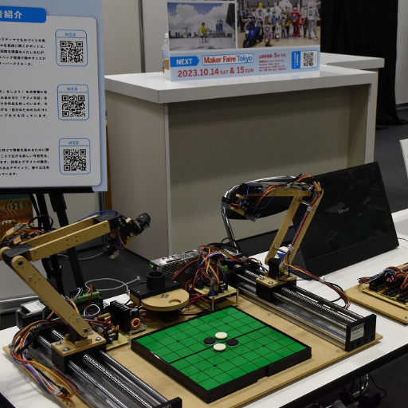
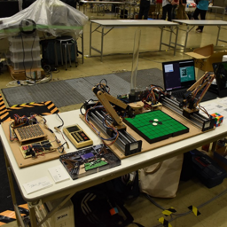
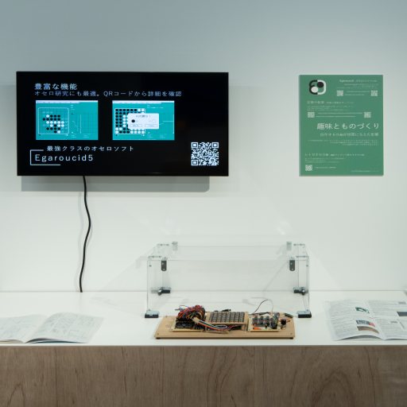
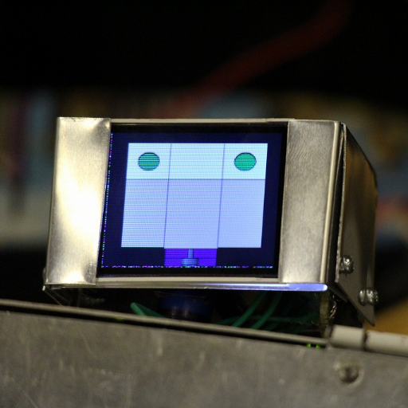
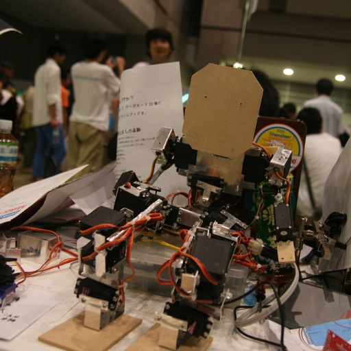

# 展示

## 近日開催

### 第７回つくばメディアアートフェスティバル

「つくばメディアアートフェスティバル」は、「科学のまちつくば」の特色を生かした、つくばならではの文化の発信を目指して 2014 年度にスタートし、今回で 7 回目の開催となります。メディアアートの分野で世界でもトップクラスの実績を誇る筑波大学の「工学・芸術連携リサーチグループ」の協力のもと、筑波大学が輩出する国際的アーティストや学内公募により選ばれた学生たちによる、分野を超えテクノロジーと芸術が融合した作品の数々を展示します。最先端の研究の成果や新しい発想の数々を、見て、体験して、学べる。科学×アートの魅力を感じてみませんか。

◆開催概要

公式ページ: [つくばメディアアートフェスティバル 2025](https://www.tsukuba-artchannel.jp/page/page000181.html)

会期: 2025 年 8 月 1 日(金)〜8 月 11 日(月・祝) 休館日:8 月 4 日(月)

会場: 茨城県つくば美術館 （茨城県つくば市吾妻 2-8 TEL:029-856-3711）[https://maps.app.goo.gl/FcX9PRP3SodK9ASp8](https://maps.app.goo.gl/FcX9PRP3SodK9ASp8)

開館時間: 9:30〜17:00 （最終日は 13:00 閉館、入場は閉館の 30 分前まで）

入場無料

### Maker Faire Tokyo 2025

公式ページ: [Maker Faire Tokyo 2025](https://makezine.jp/event/mft2025/)

日時: 2025/10/4（土）12:00～18:00、2025/10/5（日）10:00〜17:00

会場: 東京ビッグサイト　西4ホール (東京都江東区有明3-11-1)

入場料: ［前売］大人 1,400円 / 18歳以下 500円、［当日］大人 1,800円 / 18歳以下 700円

## アーカイブ

    <a href="./sohosai_2024/">
        
        

            
雙峰祭2024 メイカー〆切祭 (2024)

        

    </a>

    <a href="./maker_faire_tokyo_2024/">
        
        

            
Maker Faire Tokyo 2024 (2024)

        

    </a>

    <a href="./kuma_experiment_23_24_vol1/">
        
        

            
KUMA experiment 2023-24 vol.1 めくる、くぐる (2023)

        

    </a>

    <a href="./edgetech_plus_2022/">
        
        

            
EdgeTech+ 2022 Maker Faire Tokyo 出張版 (2022)

        

    </a>

    <a href="./kuma_experiment_vol1/">
        
        

            
Kuma experiment vol.1 二回ひねって一度たつ (2022)

        

    </a>

    <a href="./maker_faire_tokyo_2022/">
        
        

            
Maker Faire Tokyo 2022 (2022)

        

    </a>

    <a href="./kuma_exhibition_2022/">
        
        

            
KUMA EXHIBITION 2022 Trans X Formation (2022)

        

    </a>

    <a href="./maker_faire_tokyo_2021/">
        
        

            
Maker Faire Tokyo 2021 (2021)

        

    </a>

    <a href="./maker_faire_tokyo_2020/">
        
        

            
Maker Faire Tokyo 2020 (2020)

        

    </a>

    <a href="./world_maker_faire_new_york_2018/">
        
        

            
World Maker Faire New York 2018 (2018)

        

    </a>

    <a href="./maker_faire_tokyo_2018/">
        
        

            
Maker Faire Tokyo 2018 (2018)

        

    </a>

    <a href="./maker_faire_tokyo_2017/">
        
        

            
Maker Faire Tokyo 2017 (2017)

        

    </a>

    <a href="./maker_faire_tokyo_2015/">
        
        

            
Maker Faire Tokyo 2015 (2015)

        

    </a>

