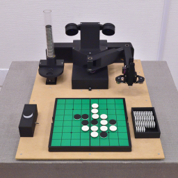

# 展示

## 近日開催

### Maker Faire Tokyo 2025

公式ページ: [Maker Faire Tokyo 2025](https://makezine.jp/event/mft2025/)

日時: 2025/10/4（土）12:00～18:00、2025/10/5（日）10:00〜17:00

会場: 東京ビッグサイト　西4ホール (東京都江東区有明3-11-1)

入場料: ［前売］大人 1,400円 / 18歳以下 500円、［当日］大人 1,800円 / 18歳以下 700円

## アーカイブ

    <a href="./tsukuba_media_art_festival_2025/">
        
        

            
第7回つくばメディアアートフェスティバル (2025)

        

    </a>

    <a href="./sohosai_2024/">
        
        

            
雙峰祭2024 メイカー〆切祭 (2024)

        

    </a>

    <a href="./maker_faire_tokyo_2024/">
        
        

            
Maker Faire Tokyo 2024 (2024)

        

    </a>

    <a href="./kuma_experiment_23_24_vol1/">
        
        

            
KUMA experiment 2023-24 vol.1 めくる、くぐる (2023)

        

    </a>

    <a href="./edgetech_plus_2022/">
        
        

            
EdgeTech+ 2022 Maker Faire Tokyo 出張版 (2022)

        

    </a>

    <a href="./kuma_experiment_vol1/">
        
        

            
Kuma experiment vol.1 二回ひねって一度たつ (2022)

        

    </a>

    <a href="./maker_faire_tokyo_2022/">
        
        

            
Maker Faire Tokyo 2022 (2022)

        

    </a>

    <a href="./kuma_exhibition_2022/">
        
        

            
KUMA EXHIBITION 2022 Trans X Formation (2022)

        

    </a>

    <a href="./maker_faire_tokyo_2021/">
        
        

            
Maker Faire Tokyo 2021 (2021)

        

    </a>

    <a href="./maker_faire_tokyo_2020/">
        
        

            
Maker Faire Tokyo 2020 (2020)

        

    </a>

    <a href="./world_maker_faire_new_york_2018/">
        
        

            
World Maker Faire New York 2018 (2018)

        

    </a>

    <a href="./maker_faire_tokyo_2018/">
        
        

            
Maker Faire Tokyo 2018 (2018)

        

    </a>

    <a href="./maker_faire_tokyo_2017/">
        
        

            
Maker Faire Tokyo 2017 (2017)

        

    </a>

    <a href="./maker_faire_tokyo_2015/">
        
        

            
Maker Faire Tokyo 2015 (2015)

        

    </a>

