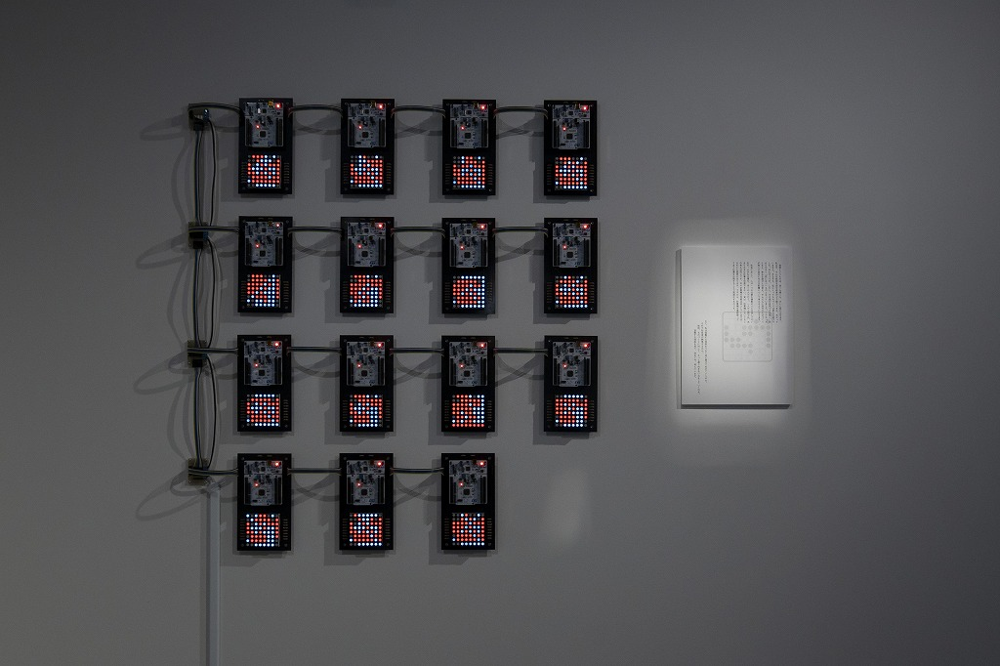
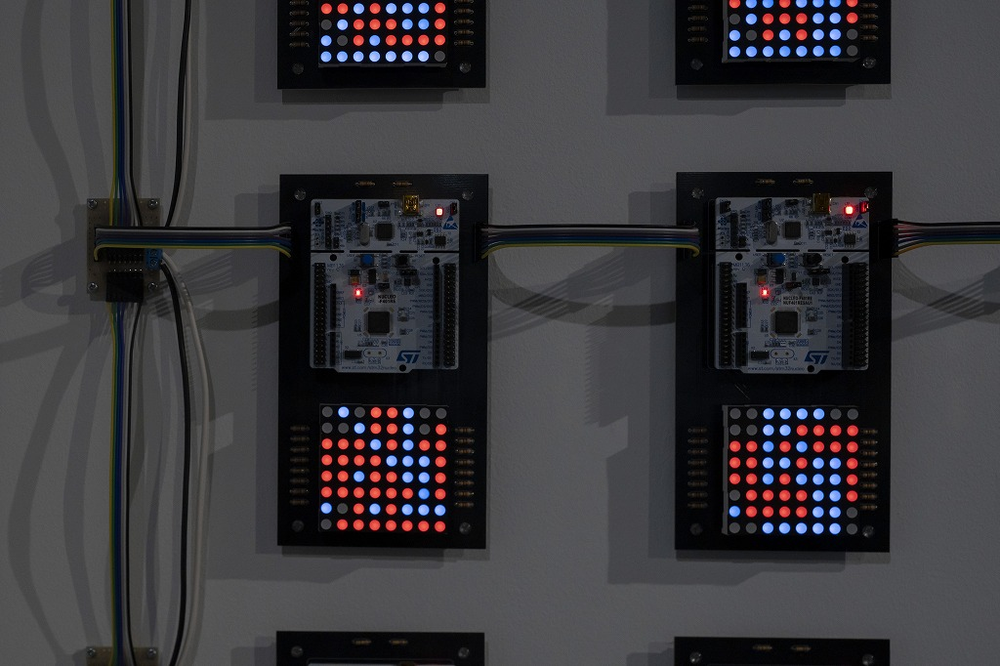

## KUMA experiment 2023-24 vol.1 めくる、くぐる

協働する技術 (2023)

出展物は協働する技術です。

    

    

    

    

写真: 公益財団法人クマ財団

## 詳細

日程: 2023/10/14-29

場所: クマ財団ギャラリー

[展示会の詳細ページ](https://kuma-foundation.org/gallery/event/kuma-experiment23-24_01/)
