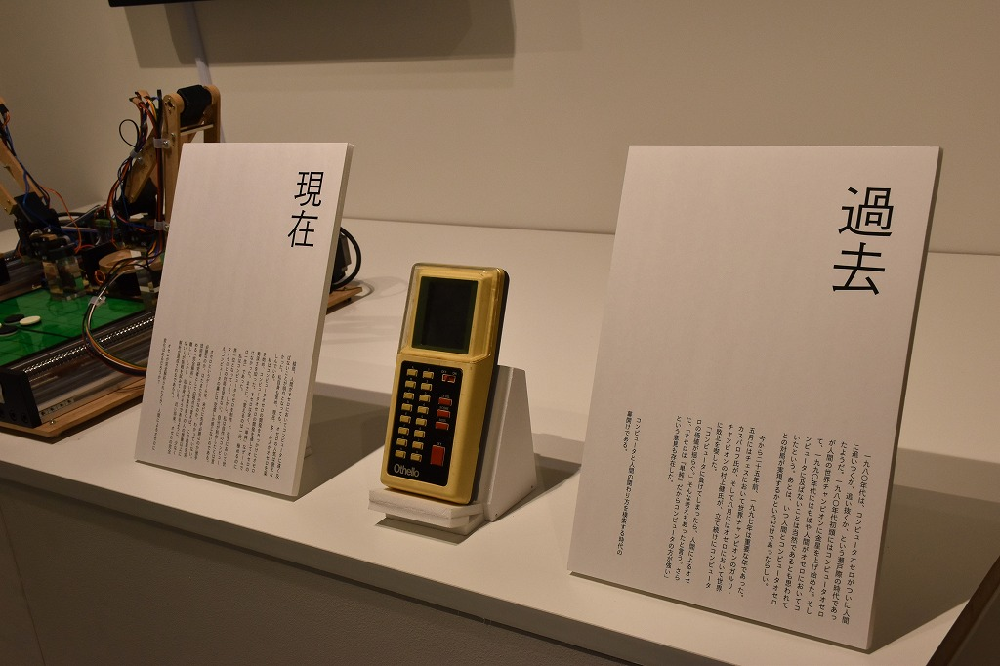

# Kuma experiment vol.1 二回ひねって一度たつ

コンピュータと人間 (2022)

出展物はIsevot、コンピューターオセロ、オセロの音、過去・現在・未来です。

    

    

    

    

    

## 詳細

日程: 2022/10/15-23

場所: クマ財団ギャラリー

[展示会の詳細ページ](https://kuma-foundation.org/gallery/event/kuma-experiment22-01/)
