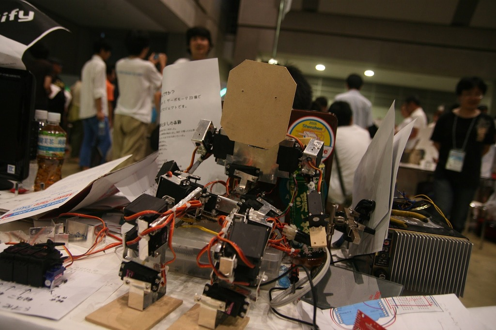

# Maker Faire Tokyo 2015

YamaX、"しんとま" (2015)

中学生で構成されるチームY-modifyとして出展しました。展示物はYamaX、自作ゲーム"しんとま"、"ぶつからない車"などです。私は主にYamaX開発に携わりました。

    

## 詳細

日程: 2015/8/1-2

場所: 東京ビッグサイト

<a href="https://makezine.jp/event/makers2015/y-modify/" target="_blank" el=”noopener noreferrer”>出展者ページ</a>

