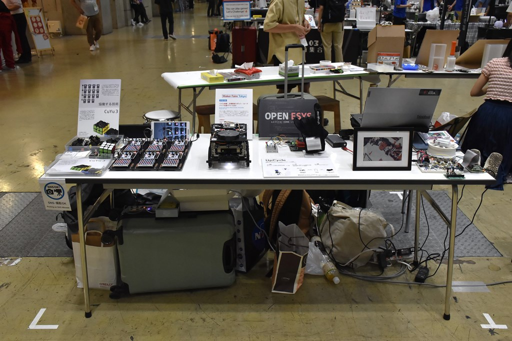
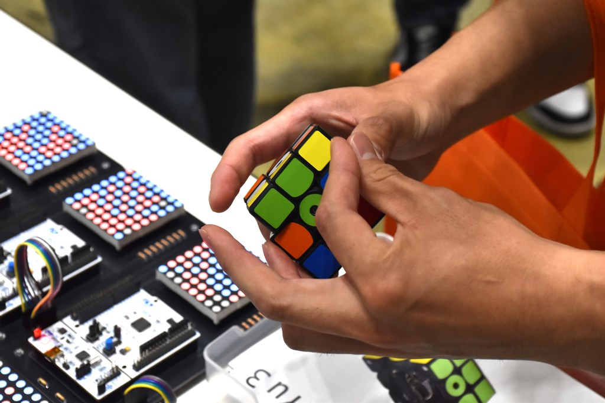
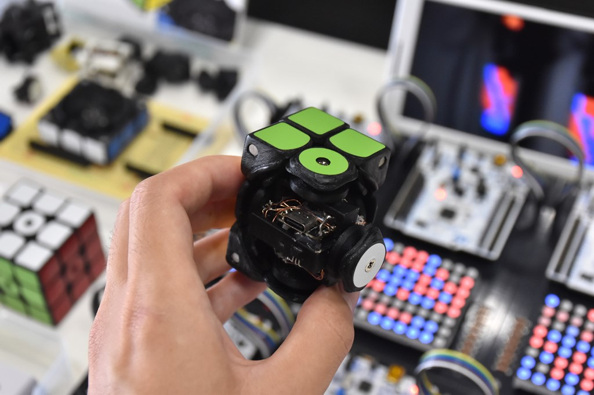

# Maker Faire Tokyo 2024

パズル楽器・災害救助ロボット・ロードバイク支援デバイスほか (2024)

筑波大学のものづくり団体「OpenEsys」として出展しました。

私の出展物はCuYu3、協働する技術の2点です。

    
    
    
    
    

## 詳細

日程: 2024/9/21-22

場所: 東京ビッグサイト

[出展者ページ](https://makezine.jp/event/makers-mft2024/m0149/)

