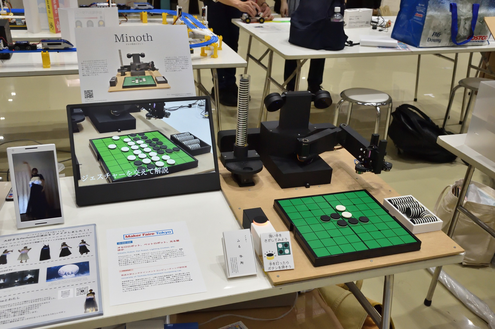
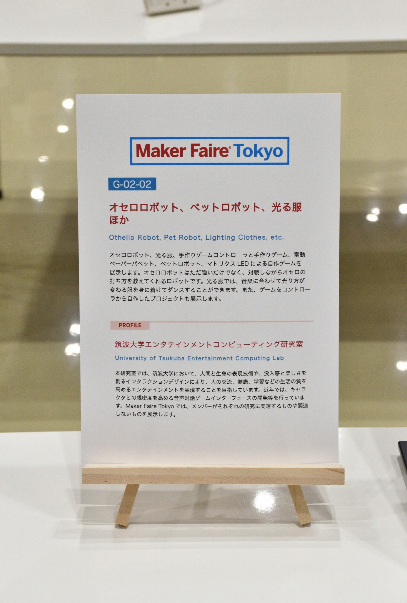

# Maker Faire Tokyo 2025

オセロロボット、ペットロボット、光る服ほか (2025)

[筑波大学エンタテインメントコンピューティング研究室](https://entcomp.jp/)として出展しました。

私の出展物はオセロ教授ロボット "Minoth" です。

    
    
    
    
    

## 詳細

公式ページ: [Maker Faire Tokyo 2025](https://makezine.jp/event/mft2025/)

日時: 2025/10/4（土）12:00～18:00、2025/10/5（日）10:00〜17:00

会場: 東京ビッグサイト　西4ホール (東京都江東区有明3-11-1)

入場料: ［前売］大人 1,400円 / 18歳以下 500円、［当日］大人 1,800円 / 18歳以下 700円

[出展者ページ](https://makezine.jp/event/makers-mft2025/m0071/)

