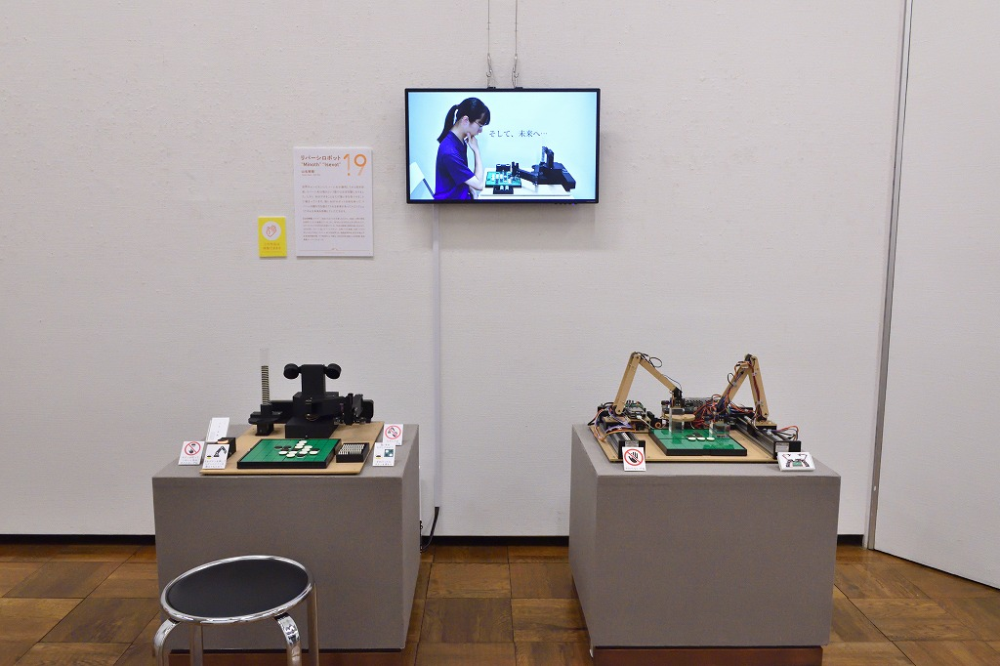
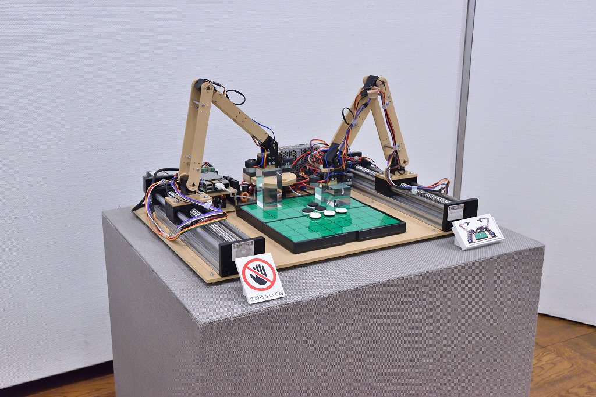
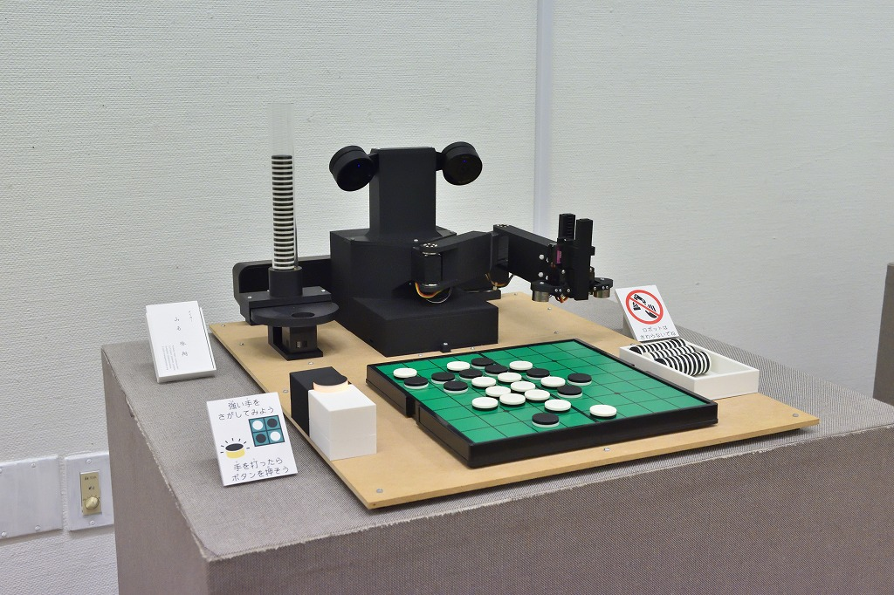
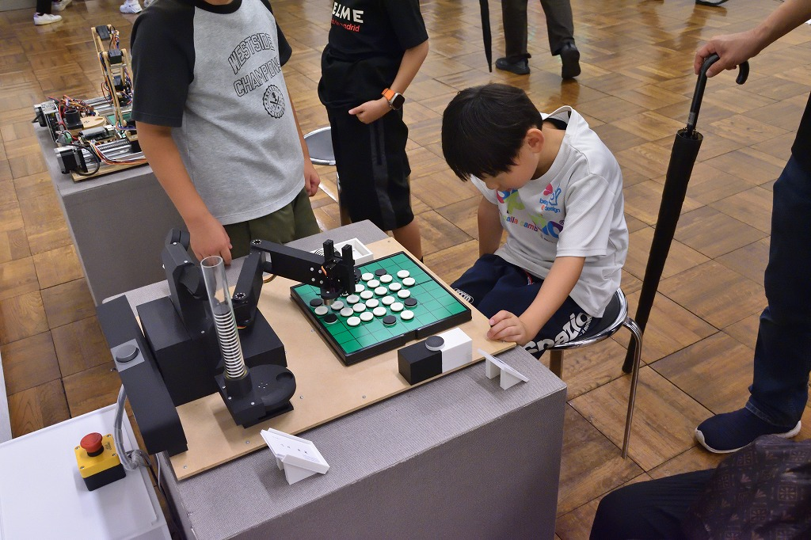
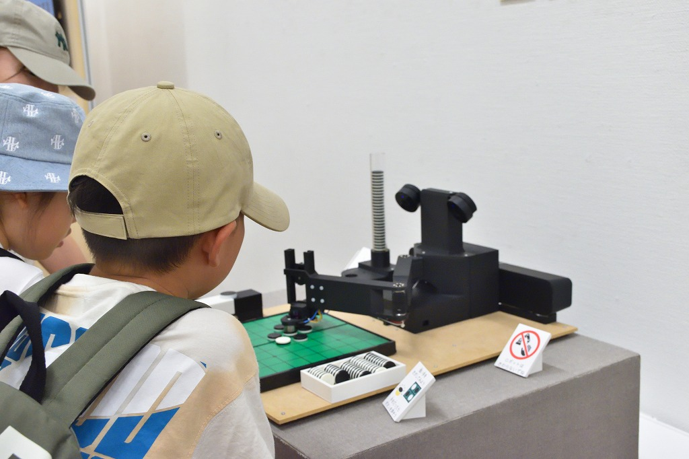
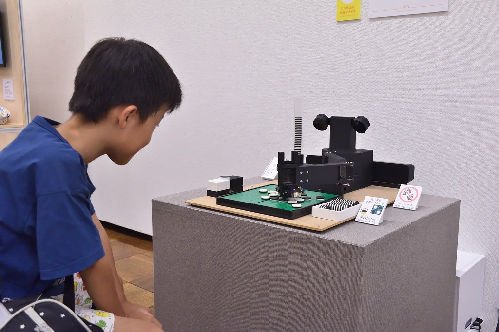

# 第７回つくばメディアアートフェスティバル

リバーシロボット "Minoth" "Isevot" (2025)

新作のリバーシ教授ロボット"Minoth"と、2022年に制作したリバーシロボット"Isevot"を展示しました。

    
    
    
    
    
    

## 詳細

「つくばメディアアートフェスティバル」は、「科学のまちつくば」の特色を生かした、つくばならではの文化の発信を目指して 2014 年度にスタートし、今回で 7 回目の開催となります。メディアアートの分野で世界でもトップクラスの実績を誇る筑波大学の「工学・芸術連携リサーチグループ」の協力のもと、筑波大学が輩出する国際的アーティストや学内公募により選ばれた学生たちによる、分野を超えテクノロジーと芸術が融合した作品の数々を展示します。最先端の研究の成果や新しい発想の数々を、見て、体験して、学べる。科学×アートの魅力を感じてみませんか。

◆開催概要

公式ページ: [つくばメディアアートフェスティバル 2025](https://www.tsukuba-artchannel.jp/page/page000181.html)

会期: 2025 年 8 月 1 日(金)〜8 月 11 日(月・祝) 休館日:8 月 4 日(月)

会場: 茨城県つくば美術館 （茨城県つくば市吾妻 2-8 TEL:029-856-3711）[https://maps.app.goo.gl/FcX9PRP3SodK9ASp8](https://maps.app.goo.gl/FcX9PRP3SodK9ASp8)

開館時間: 9:30〜17:00 （最終日は 13:00 閉館、入場は閉館の 30 分前まで）

入場無料
