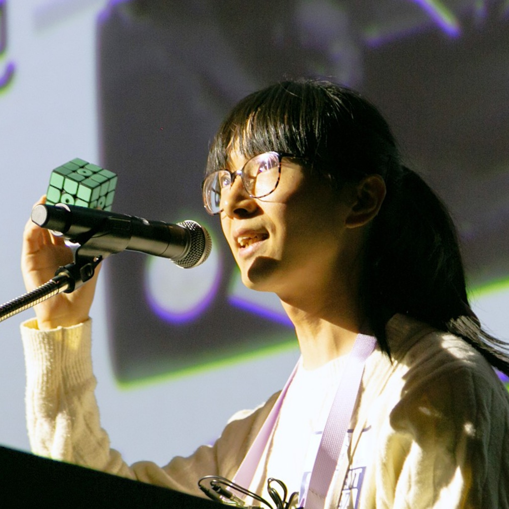

# 山名琢翔

ものづくりとものづくりが好きな人が好きな人

## 山名琢翔とは

2001年生まれ。ものづくりを楽しむかたわら、「誰もが好きなときに好きなだけものづくりを楽しめるようにしたい」という考えのもと、ものづくりに関する様々な情報を活発に発信しています。さらに、技術と人間の関わりについて非常に強い興味を持っています。プログラミングやロボット製作などをメインとしつつ、水引細工や折り紙、切り絵など様々なものづくりを楽しんでいます。情報発信の領域では、作品製作で培った技術を平易なものから高度なものまで幅広く解説しています。

## スキル

プログラミング

<table class="skill_table"><tbody>
<tr><td>C/C++</td><td>★★★★★</td></tr>
<tr><td>Python</td><td>★★★★★</td></tr>
<tr><td>CUDA C++</td><td>★★★★</td></tr>
<tr><td>TensorFlow</td><td>★★★</td></tr>
<tr><td>HTML/CSS/JavaScript</td><td>★★</td></tr>
</tbody></table>

マイコンなど

<table class="skill_table"><tbody>
<tr><td>Arduino</td><td>★★★★★</td></tr>
<tr><td>ESP32</td><td>★★★★★</td></tr>
<tr><td>STM32</td><td>★★★</td></tr>
<tr><td>Raspberry Pi</td><td>★★★★</td></tr>
<tr><td>Raspberry Pi Pico</td><td>★★★</td></tr>
</tbody></table>

電子工作

<table class="skill_table"><tbody>
<tr><td>はんだ付け</td><td>★★★★★</td></tr>
<tr><td>回路設計</td><td>★★★</td></tr>
<tr><td>基板設計</td><td>★★★</td></tr>
</tbody></table>

ロボット製作

<table class="skill_table"><tbody>
<tr><td>機体設計</td><td>★★★</td></tr>
<tr><td>機体製作</td><td>★★★★</td></tr>
</tbody></table>

工作機械

<table class="skill_table"><tbody>
<tr><td>卓上CNCフライス盤</td><td>★★★★★</td></tr>
<tr><td>FFF 3Dプリンタ</td><td>★★★★</td></tr>
<tr><td>SLA 3Dプリンタ</td><td>★★★</td></tr>
</tbody></table>

自然言語

<table class="skill_table"><tbody>
<tr><td>日本語</td><td>母語</td></tr>
<tr><td>英語</td><td>英検準一級 TOEIC L&R 780</td></tr>
<tr><td>中国語</td><td>ほんの少し</td></tr>
</tbody></table>

## 略歴

<table><tbody>
<tr><td>2001</td><td>誕生</td></tr>
<tr><td>2014</td><td>東京都立小石川中等教育学校入学</td></tr>
<tr><td>2020</td><td>東京都立小石川中等教育学校卒業</td></tr>
<tr><td>2020</td><td>筑波大学理工学群工学システム学類入学</td></tr>
<tr><td>2025</td><td>筑波大学理工学群工学システム学類退学</td></tr>
<tr><td>2025</td><td>筑波大学大学院デザイン学学位プログラム入学</td></tr>
</tbody></table>

