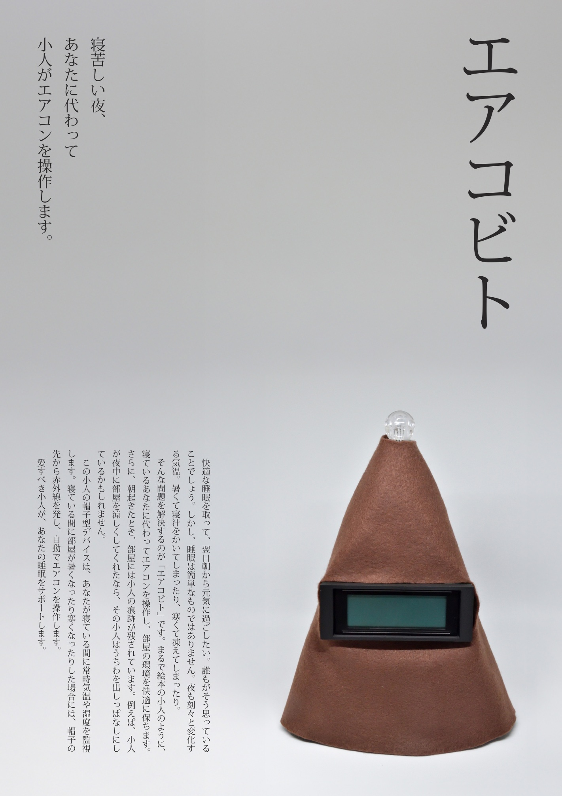

# エアコビト

睡眠を快適にしてくれる小人 (2025)

睡眠中に部屋の気温や湿度、気圧、二酸化炭素濃度を計測し、自動でエアコンを制御するデバイスです。

## 作品キャプション

寝苦しい夜、あなたに代わって小人がエアコンを操作します。

快適な睡眠を取って、翌日朝から元気に過ごしたい。誰もがそう思っていることでしょう。しかし、睡眠は簡単なものではありません。夜も刻々と変化する気温。暑くて寝汗をかいてしまったり、寒くて凍えてしまったり。

そんな問題を解決するのが「エアコビト」です。まるで絵本の小人のように、寝ているあなたに代わってエアコンを操作し、部屋の環境を快適に保ちます。さらに、朝起きたとき、部屋には小人の痕跡が残されています。例えば、小人が夜中に部屋を涼しくしてくれたなら、その小人はうちわを出しっぱなしにしているかもしれません。

この小人の帽子型デバイスは、あなたが寝ている間に常時気温や湿度を監視します。寝ている間に部屋が暑くなったり寒くなったりした場合には、帽子の先から赤外線を発し、自動でエアコンを操作します。
　愛すべき小人が、あなたの睡眠をサポートします。

    
    
    

