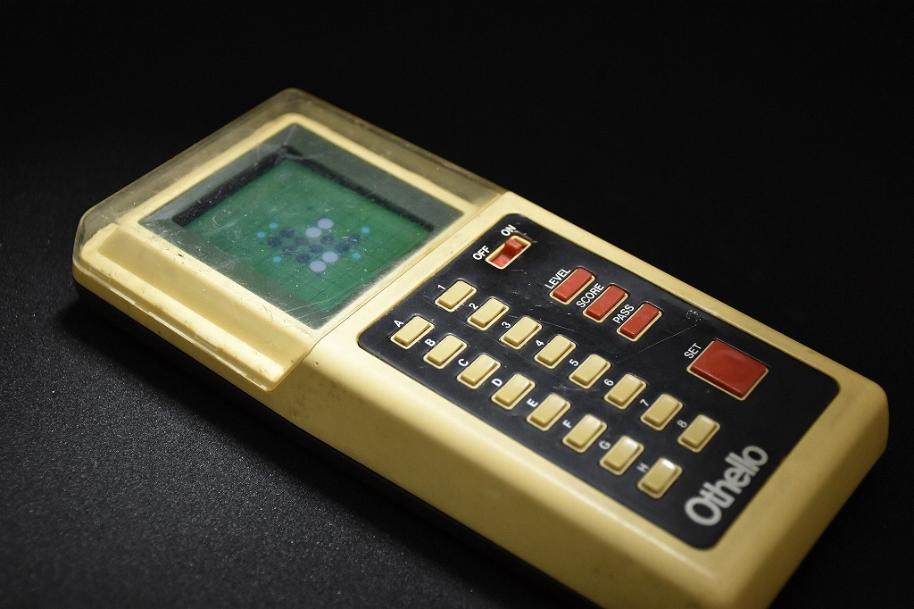
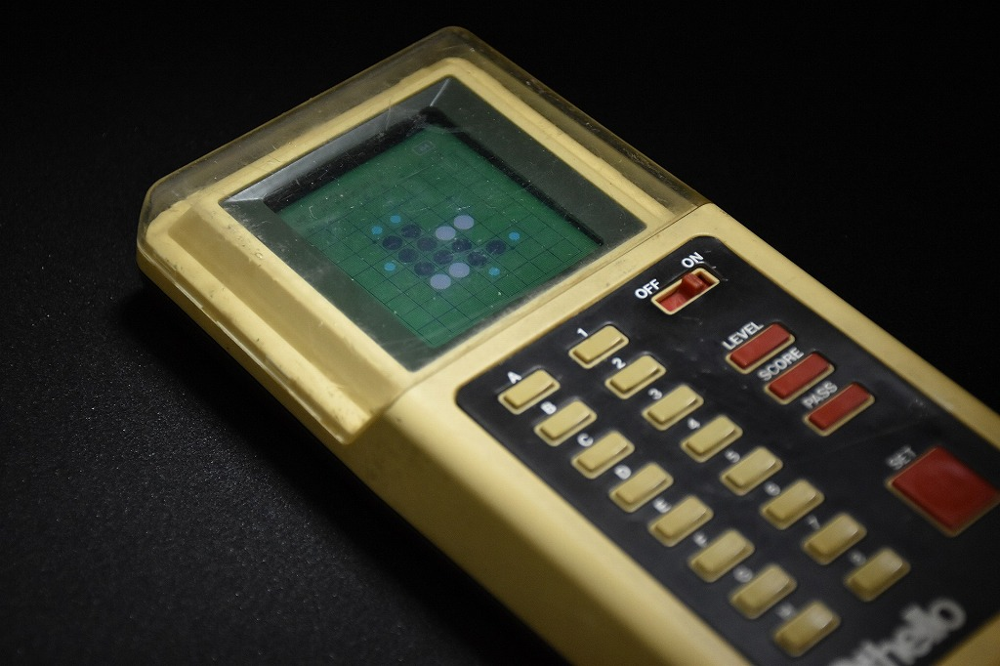

# コンピューターオセロ

1980年のオセロAIを換装 (2022)

1980年代と言えば、オセロAIが人間を上回るかどうかという瀬戸際の時代です。そんな時代が始まった頃、1980年、「コンピューターオセロ MⅡ」がツクダオリジナルから発売されていました。

オリジナルのコンピューターオセロは現代のオセロAIとは比較にならないほど弱い製品ではあるのですが、これをオセロAI世界1位の私が最新のエッジAIを用いて換装してみました。

SonyのSpresense上でPV-MCTSを動かしています。

この作品で[Maker Faire Tokyo 2022 Young Maker Challenge SPRESENSE賞](https://makezine.jp/blog/2022/10/mft2022-report-07.html)を受賞しました。

    

    

