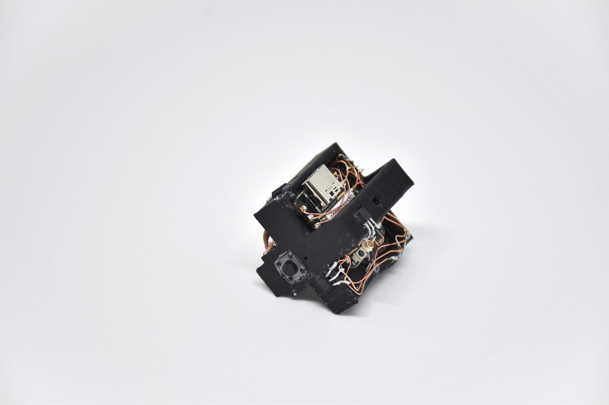

# CuYu2

立体パズル型楽器 (2024)

ルービックキューブのような自作パズルの中に回路を組み込み、回すと音が鳴る楽器にしました。

この作品は2021年の作品CuYuをアップデートしたものです。ESP32C3を使い、無線でPCと通信させて音を鳴らす構成にしました。

<iframe src="https://www.youtube.com/embed/PpIETm3XO9Q" title="YouTube video player" frameborder="0" allow="accelerometer; autoplay; clipboard-write; encrypted-media; gyroscope; picture-in-picture" allowfullscreen></iframe>

    

    

    

