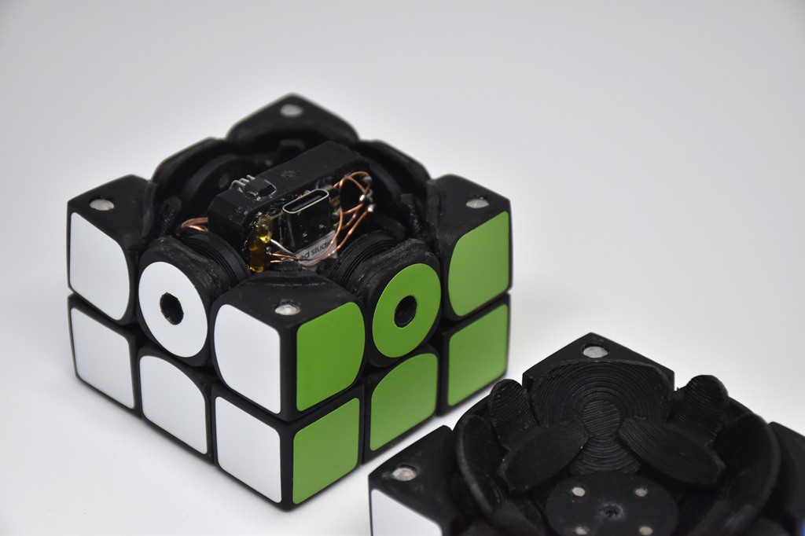
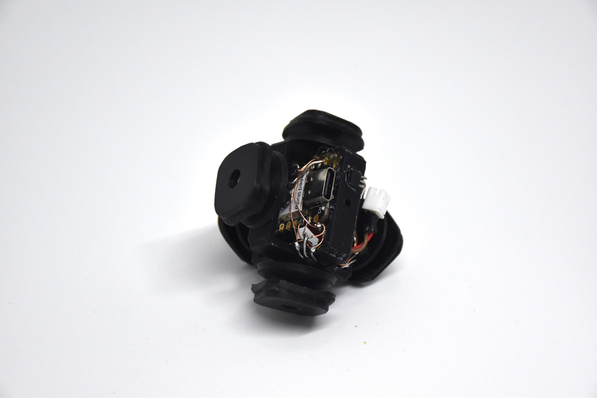
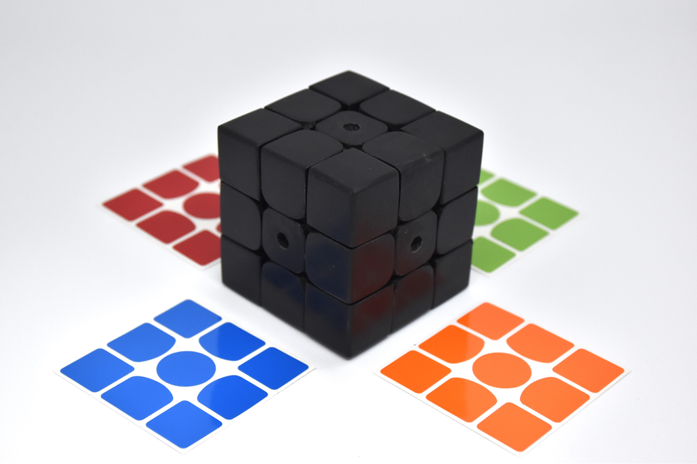

# CuYu3

立体パズル型楽器 (2024)

ルービックキューブのような自作パズルの中に回路を組み込み、回すと音が鳴る楽器にしました。CuYu、CuYu2に続く3作目です。

パズル内にESP32C3を組み込み、無線通信を行ってESP32を搭載した外部のスピーカから音を出します。CuYu2ではパソコンから音を出しますが、CuYu3は独立したスピーカから音を出します。さらに、音階を5種類用意し、切り替えられるようにしました。

    

    

    

    

