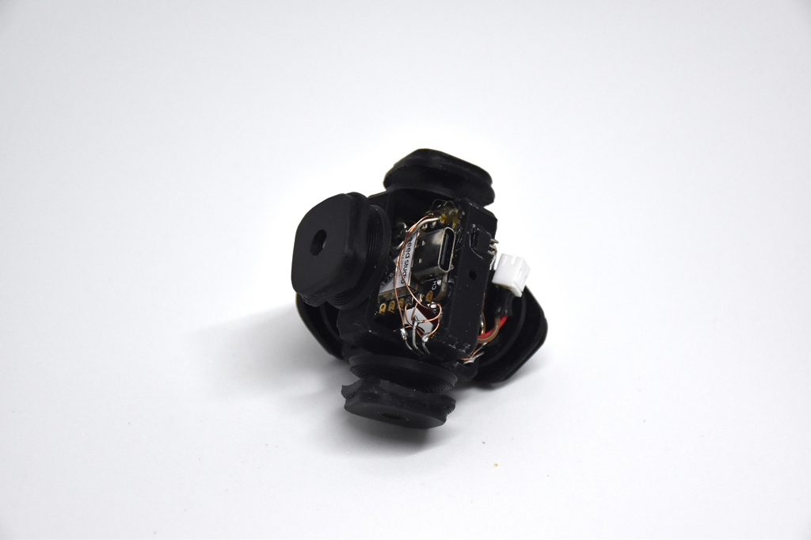

# CuYu

立体パズル型楽器 (2021-2024)

自作の立体パズルに電子回路を搭載し、回すと音が鳴る楽器にしました。通常の3x3x3版に加え、2x2x2版も制作しました。

パズルを揃えることがそのまま音楽になるほか、「プロっぽく回すだけ」で、様々な音楽を奏でることができます。

パズルは3Dプリンタで制作し、内部にESP32C3マイコンとホールセンサを搭載しました。無線によって外部スピーカと通信し、音を鳴らします。専用充電器による外部給電にも対応しています。

[技育展2024 ウイングアーク1st賞](https://talent.supporterz.jp/geekten/2024/) 受賞

<iframe src="https://www.youtube.com/embed/PpIETm3XO9Q" title="YouTube video player" frameborder="0" allow="accelerometer; autoplay; clipboard-write; encrypted-media; gyroscope; picture-in-picture" allowfullscreen></iframe>

    

    

    

    

    

    

    

