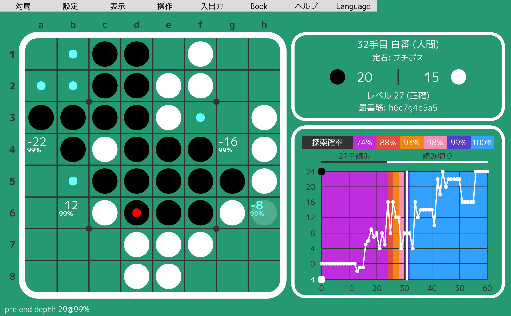
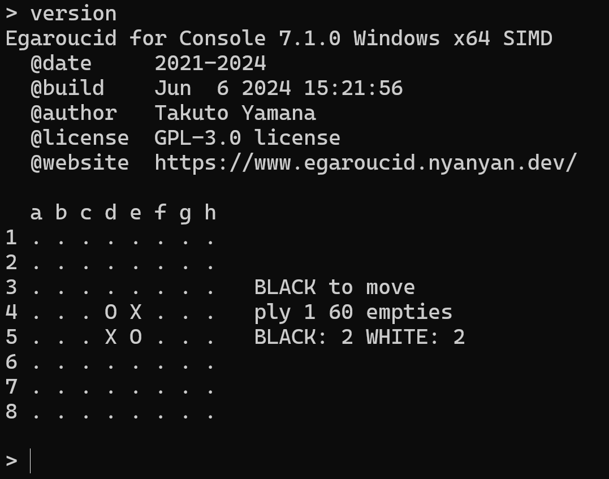
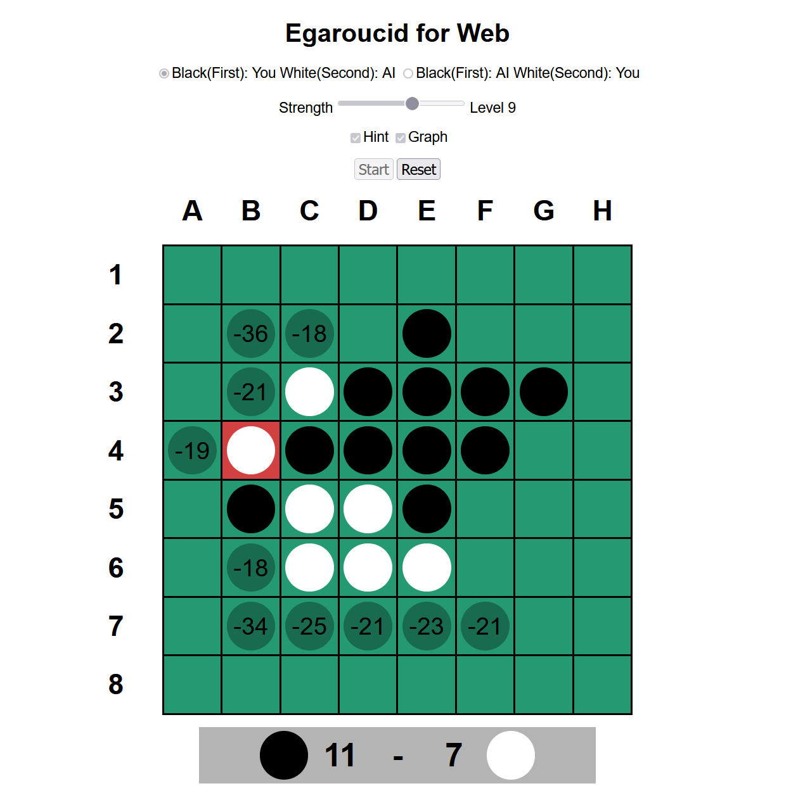

# Egaroucid

世界最強のオセロAI (2021-現在)

[Egaroucid](https://www.egaroucid.nyanyan.dev/ja/)はフルスクラッチで開発しているオセロAI、およびオセロAIを搭載したオセロ研究用ソフトウェアです。

Egaroucidの原型となったオセロAIは世界的なオセロAIコンテスト<a href="https://www.codingame.com/multiplayer/bot-programming/othello-1" target="_blank" el=”noopener noreferrer”>CodinGame Othello</a>にて世界1位となりました(2022年8月15日現在)。コンテスト版よりも強化したオセロAIを搭載した<a href="https://www.egaroucid.nyanyan.dev/ja" target="_blank" el=”noopener noreferrer”>ソフトウェア</a>をフリーソフトとして公開しています。[Egaroucid for Web](https://www.egaroucid.nyanyan.dev/ja/web)として、Webサイト上でも遊べる軽量版を公開しています。

    

    

    

