# 作品

    <a href="./minoth/">
        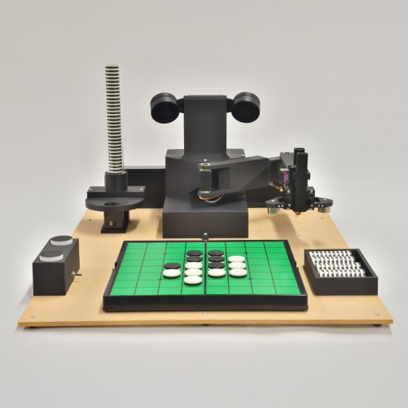
        

            
Minoth (2025-現在) オセロ教授ロボット

        

    </a>

    <a href="./egaroucid/">
        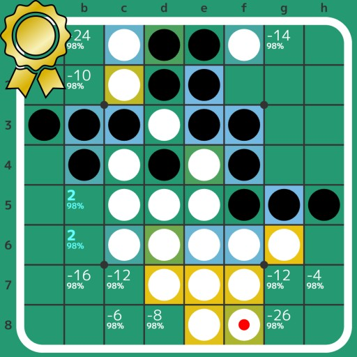
        

            
Egaroucid (2021-現在) 世界最強のオセロAI

        

    </a>

    <a href="./cuyu_series/">
        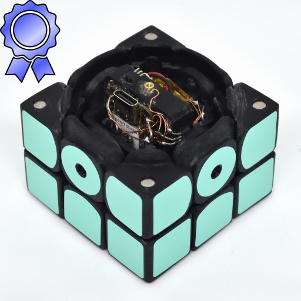
        

            
CuYu (2021-2024) 立体パズル楽器

        

    </a>

    <a href="./cotechnology/">
        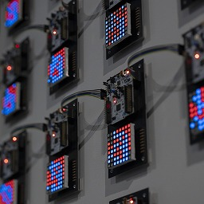
        

            
協働する技術 (2023) STM32による並列オセロAI

        

    </a>

    <a href="./winter_cherry_blossom/">
        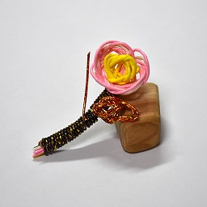
        

            
寒桜 (2023) 水引で作った寒桜

        

    </a>

    <a href="./past_now_future/">
        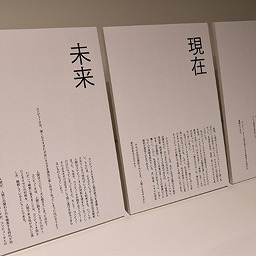
        

            
過去・現在・未来 (2022) オセロAIを通して考えるコンピュータと人間の未来

        

    </a>

    <a href="./sound_of_othello/">
        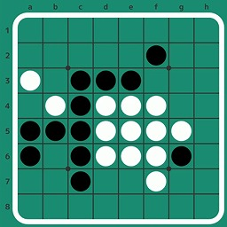
        

            
オセロの音 (2022) オセロの棋譜の音楽化

        

    </a>

    <a href="./isevot/">
        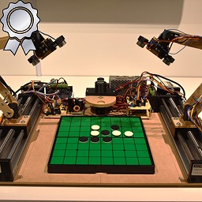
        

            
Isevot (2022) ロボット同士によるオセロ

        

    </a>

    <a href="./computer_othello/">
        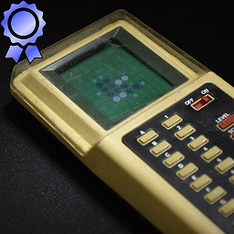
        

            
コンピューターオセロ (2022) 1980年のオセロAIを換装

        

    </a>

    <a href="./mod_rubikscube_solver_robo/">
        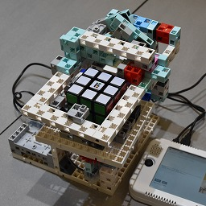
        

            
魔改造ルービックキューブソルバーロボ (2022) 商品化したロボットを改造

        

    </a>

    <a href="./egaroucen/">
        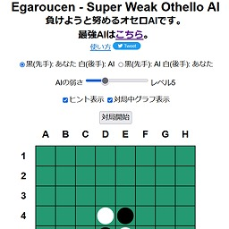
        

            
Egaroucen (2021-2022) 世界最弱のオセロAI

        

    </a>

    <a href="./retro_othello_ai/">
        
        

            
レトロオセロAI (2021-2022) 8bitマイコンで動かすオセロAI

        

    </a>

    <a href="./padurong/">
        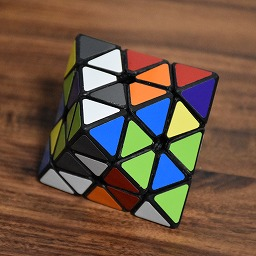
        

            
Padurong (2021) 自作Face Turn Octahedron

        

    </a>

    <a href="./qiaoke/">
        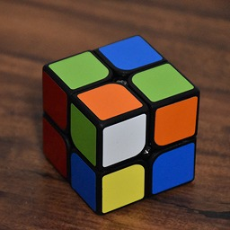
        

            
QiaoKe (2021) 自作2x2x2キューブ

        

    </a>

    <a href="./studth/">
        
        

            
Studth (2021) アーテックブロックで作るルービックキューブロボット

        

    </a>

    <a href="./nyantimer/">
        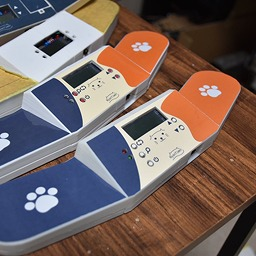
        

            
NyanTimer (2019-2021) スピードキューブ専用タイマー

        

    </a>

    <a href="./nyanclock/">
        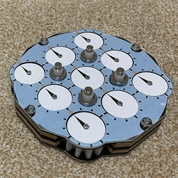
        

            
NyanClock (2020-2021) 自作クロックパズル

        

    </a>

    <a href="./solock/">
        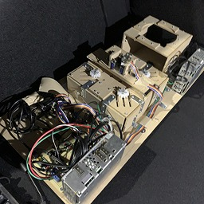
        

            
Solock (2020) ルービッククロックを世界最速で解くロボット

        

    </a>

    <a href="./solvour/">
        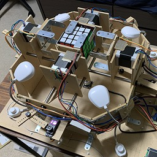
        

            
Solvour (2020) 4x4x4キューブを解くロボット

        

    </a>

    <a href="./soltvvo/">
        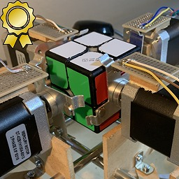
        

            
Soltvvo (2020) 2x2x2キューブを世界最速で解くロボット

        

    </a>

    <a href="./crange/">
        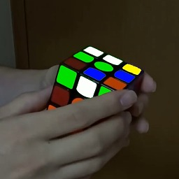
        

            
Crange (2019) パズル映像の配色変更

        

    </a>

    <a href="./monomotion/">
        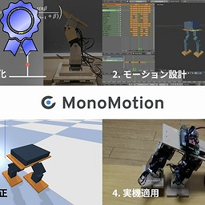
        

            
MonoMotion (2017-2019) ロボットのモーション作成支援システム

        

    </a>

    <a href="./yamax/">
        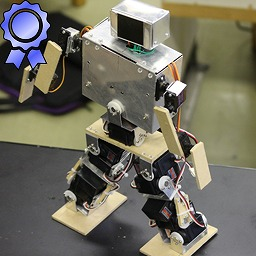
        

            
YamaX (2014-2019) 自作ヒューマノイドロボット

        

    </a>

    <a href="./yamamijuta/">
        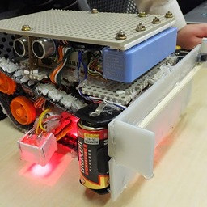
        

            
やまみじゅた1号 (2014) RoboCup Junior レスキューA部門東東京大会に出場したロボット

        

    </a>

    <a href="./linetracer/">
        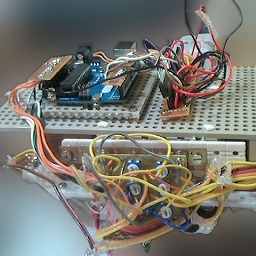
        

            
ライントレーサー (2014) Arduinoを使用した初のロボット

        

    </a>

