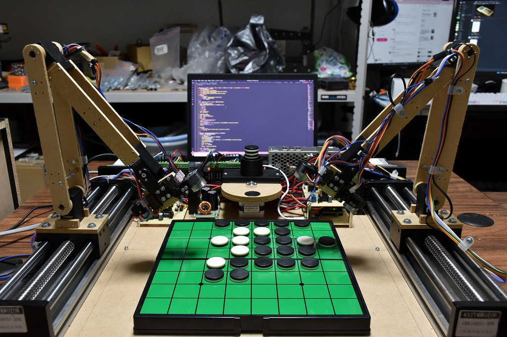

# Isevot

ロボット同士によるオセロ (2022)

Isevotは自作オセロAI Egaroucidを搭載した2台のロボットです。ロボット同士でオセロの対局を行います。

製作の背景を[文章](https://note.com/nyanyan_cubetech/n/n7262af06aefb)でも公開しています。

<iframe src="https://www.youtube.com/embed/bV2cLeHRmJw" title="YouTube video player" frameborder="0" allow="accelerometer; autoplay; clipboard-write; encrypted-media; gyroscope; picture-in-picture" allowfullscreen></iframe>

    

    

