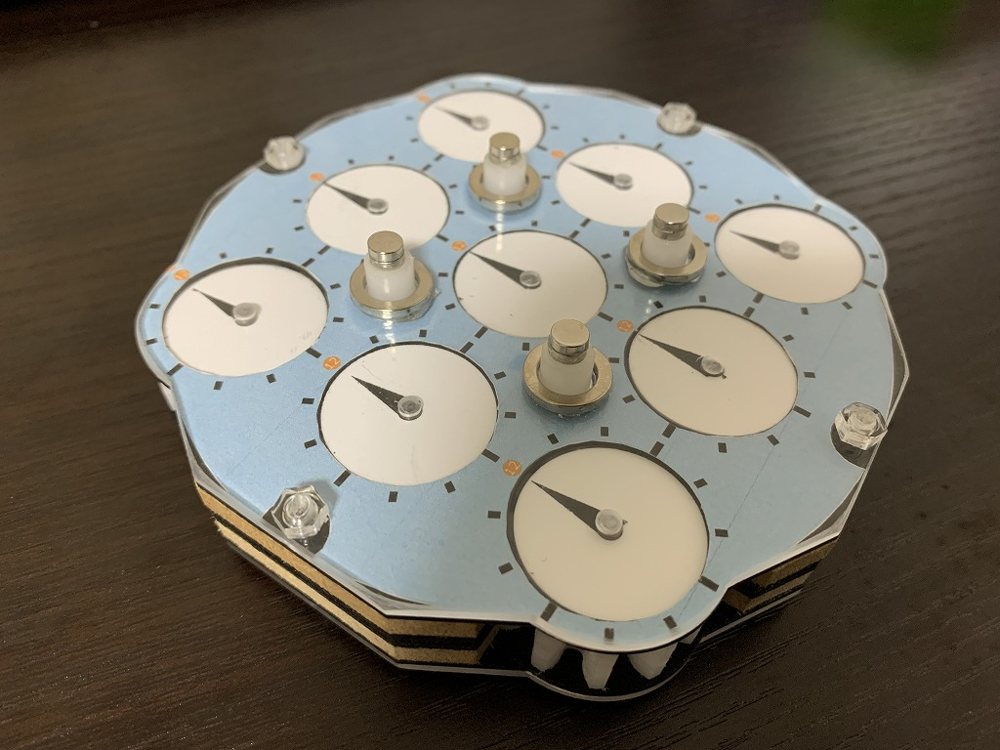
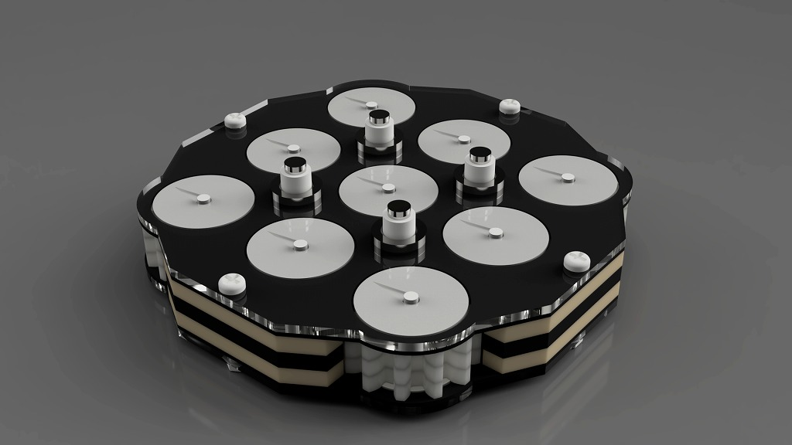
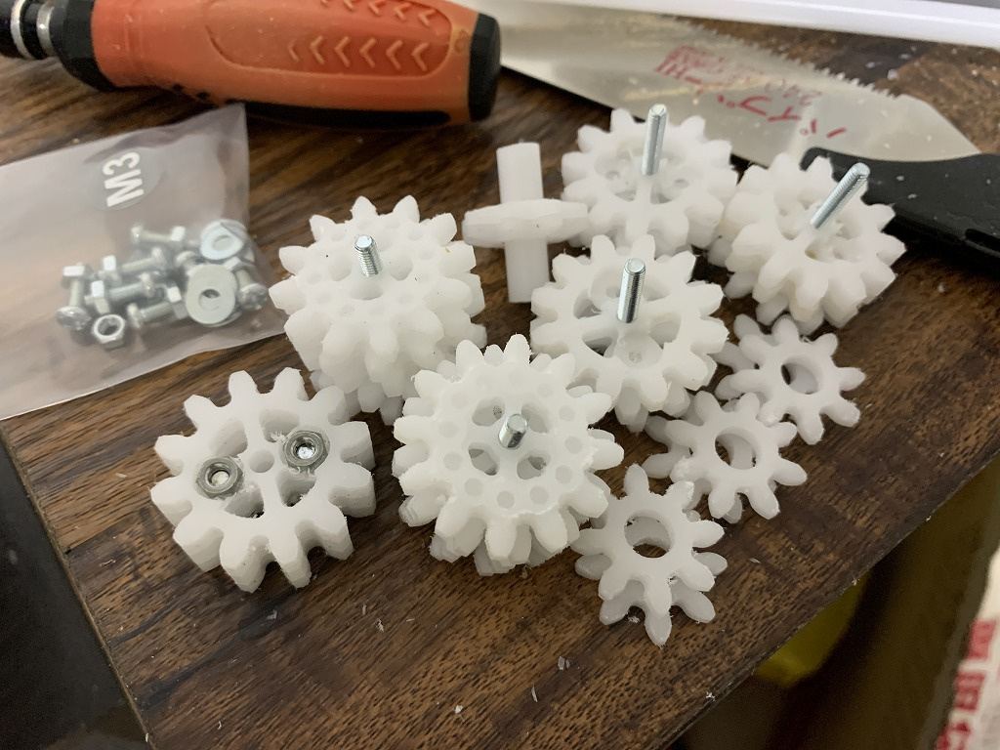
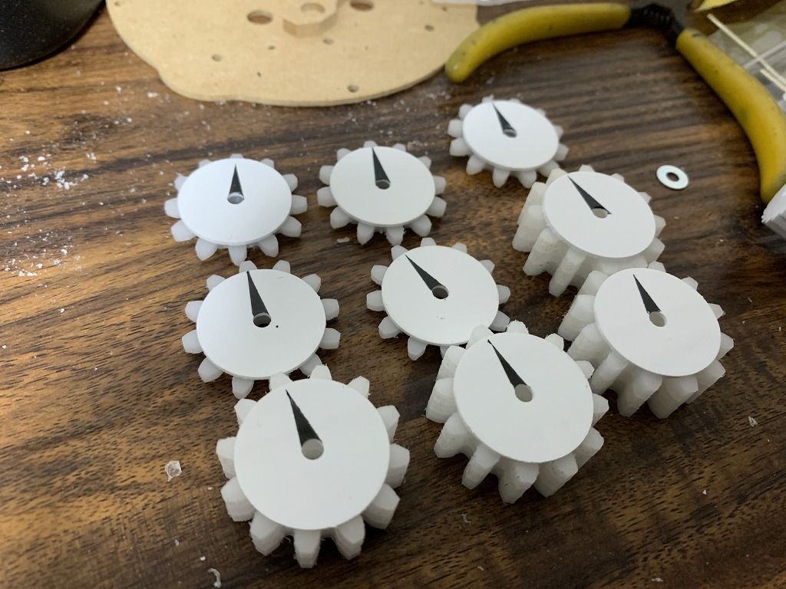

# NyanClock

自作クロックパズル (2020-2021)

CNCフライス盤を用いて製作した、ルービッククロックと同等のパズルです。

<iframe src="https://www.youtube.com/embed/vNmKay3xpig" title="YouTube video player" frameborder="0" allow="accelerometer; autoplay; clipboard-write; encrypted-media; gyroscope; picture-in-picture" allowfullscreen></iframe>

    

    

    

    

