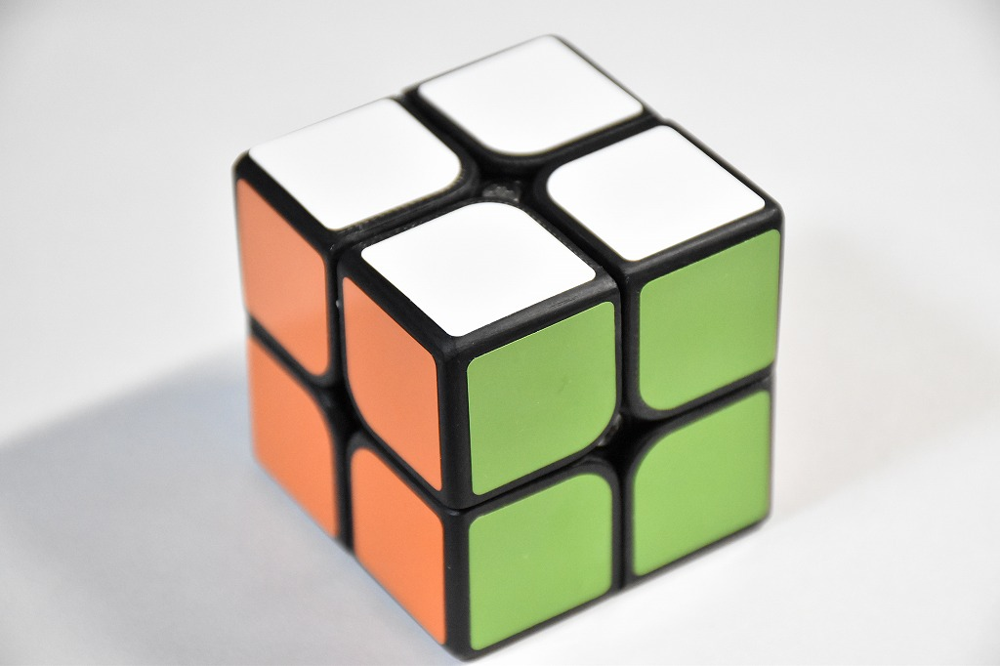
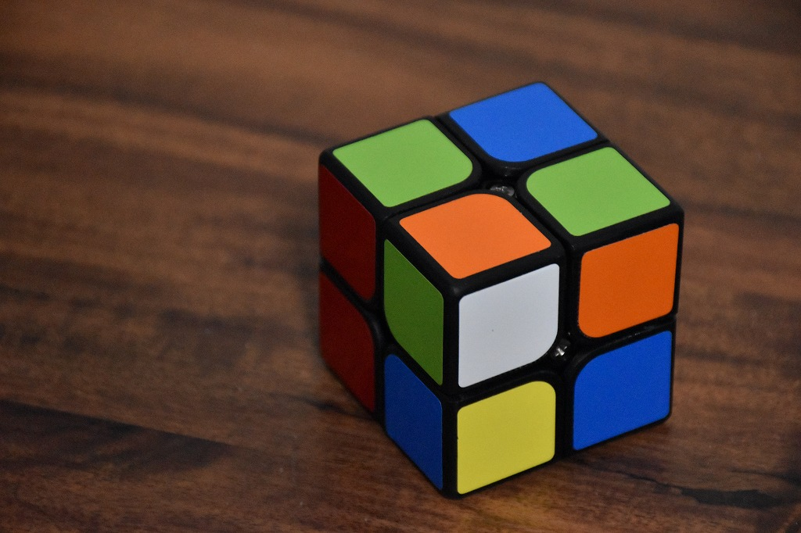
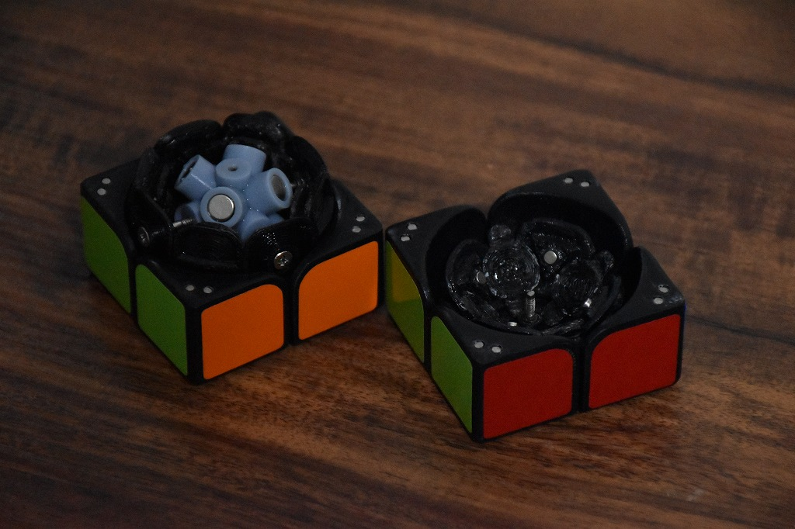

# QiaoKe

自作2x2x2キューブ (2021)

3Dプリンタで製作した自作の2x2x2キューブパズルです。

<iframe src="https://www.youtube.com/embed/NJjfOaxSceI" title="YouTube video player" frameborder="0" allow="accelerometer; autoplay; clipboard-write; encrypted-media; gyroscope; picture-in-picture" allowfullscreen></iframe>

    

    

    

