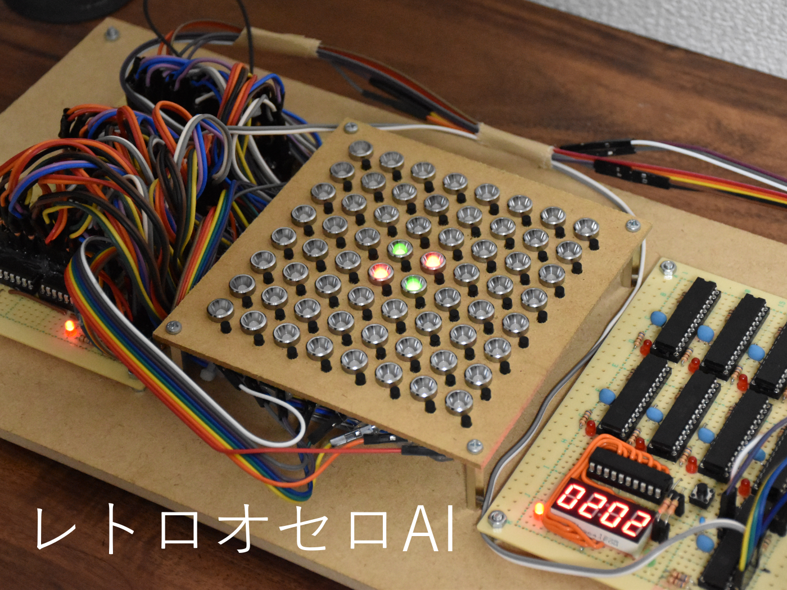

# レトロオセロAI

8bitマイコンで動かすオセロAI (2021-2022)

8bitマイコン(ATMEGA328P)を10個使って動かしたオセロAI、および対戦インターフェイスです。

10個のマイコンのうち9つを並列に動作させることでAIの高速化を実現しました。並列化アルゴリズムにはYBWCを使用しました。

<iframe src="https://www.youtube.com/embed/I_ctZKlP2XA" title="YouTube video player" frameborder="0" allow="accelerometer; autoplay; clipboard-write; encrypted-media; gyroscope; picture-in-picture" allowfullscreen></iframe>

    

