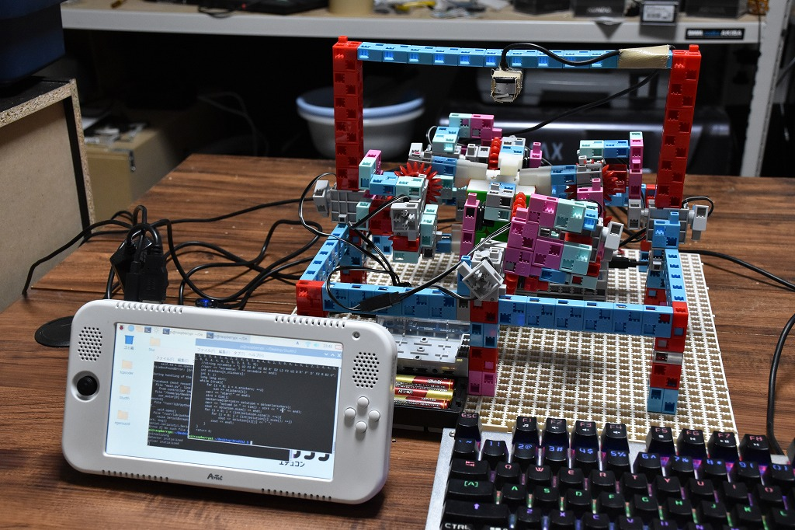
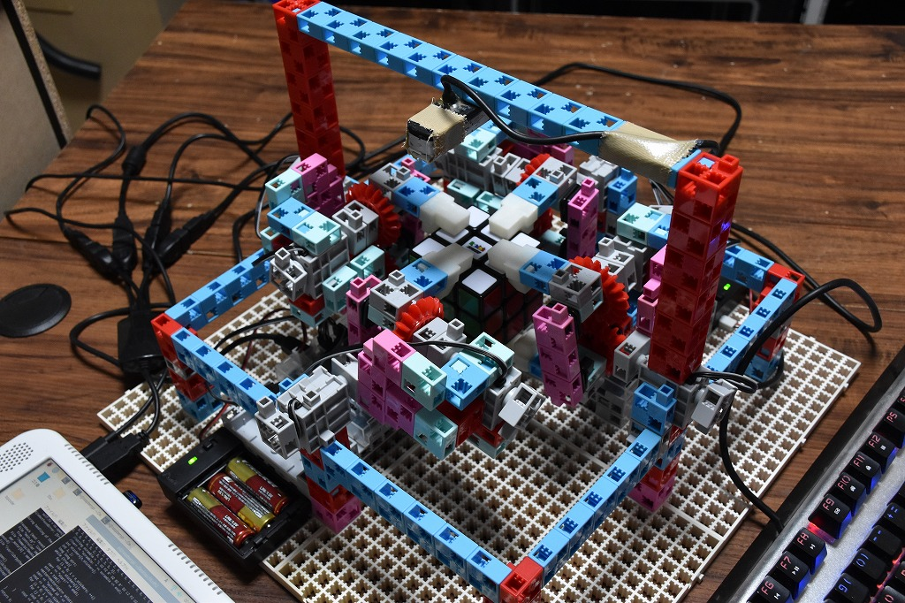
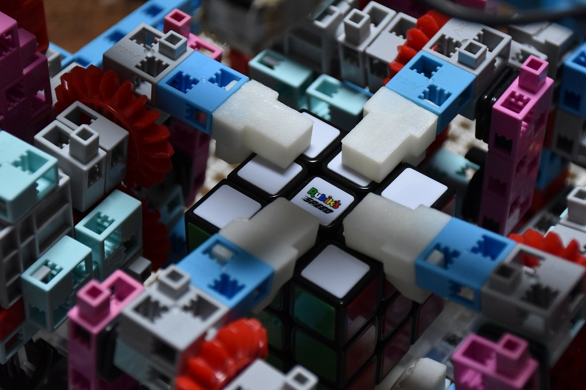

# Studth

アーテックブロックで作るルービックキューブロボット (2021)

Artec社のアーテックブロック、Studuino、eduコンを使用して製作したルービックキューブを解くロボットです。

<iframe src="https://www.youtube.com/embed/ETX0saH9TMM" title="YouTube video player" frameborder="0" allow="accelerometer; autoplay; clipboard-write; encrypted-media; gyroscope; picture-in-picture" allowfullscreen></iframe>

    

    

    

