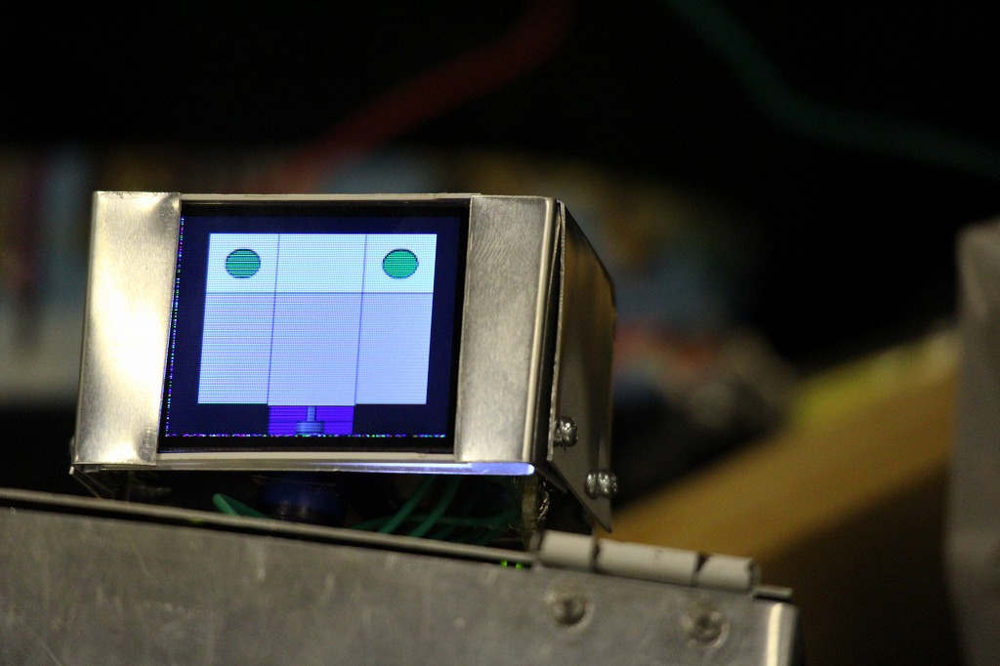

# Maker Faire Tokyo 2017

YamaX -高校生のヒューマノイド (2017)

高校生で構成されるチームY-modifyとして出展しました。展示物は自作ヒューマノイドロボット"YamaX"です。

    

## 詳細

日程: 2017/8/5-6

場所: 東京ビッグサイト

<a href="https://makezine.jp/event/makers2017/m0205/" target="_blank" el=”noopener noreferrer”>出展者ページ</a>

